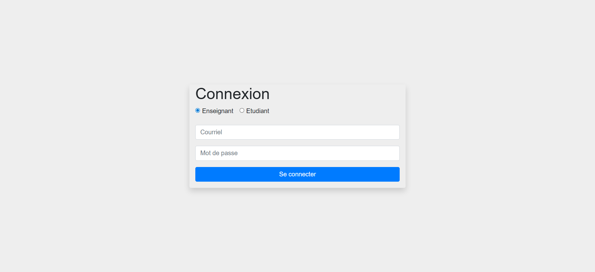
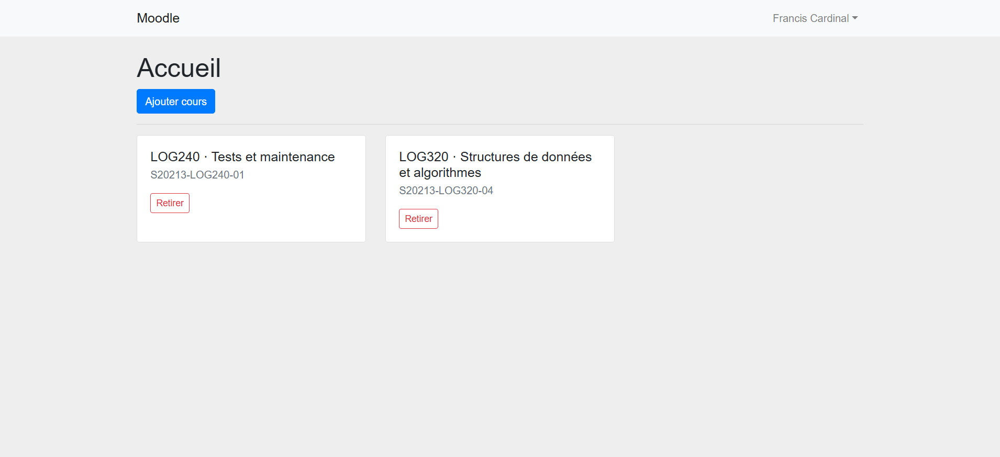
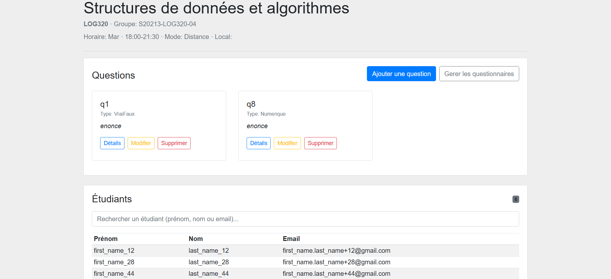
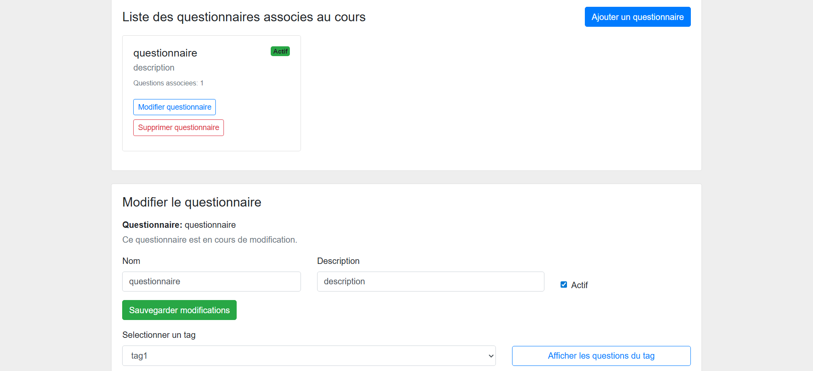
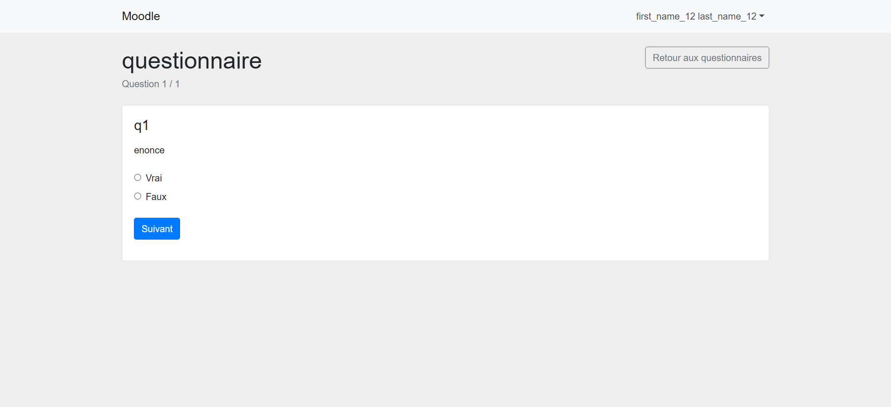
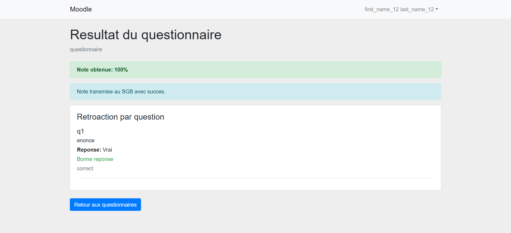

# Système de Gestion de l’Apprentissage (SGA)

A learning management system built with TypeScript, Node.js, and Express.

SGA is a Moodle-inspired learning management platform designed for teacher and student learning workflows. It supports course activities around questionnaires, assignments, submissions, and grading flows, while integrating with the external SGB service for authentication and course/student/grade-related data.

## Features

- Authentication with role-based flows (teacher and student) via external SGB.
- Session-based access control for protected routes.
- Course management for teachers: fetch assigned groups from SGB, add/remove course groups, view course details.
- Student course view: access enrolled course questionnaires.
- Question bank management per course:
	- Add, list, select, edit, and delete questions.
	- Supported types: Vrai/Faux, Choix Multiple, Numerique, Reponse Courte, Mise en Correspondance, Essai.
- Questionnaire management:
	- Create/update/delete questionnaires.
	- Activate/deactivate questionnaires.
	- Tag-based question selection and ordering.
	- Safeguards when questionnaires already contain student results.
- Student questionnaire workflow:
	- Start attempts, answer questions, and view results/feedback.
	- Support for questionnaire types requiring manual grading, such as essay and matching questions.
- Grade integration with SGB (`grade/insert`) for questionnaire and assignment workflows.
- Automated test suite across application, controllers, routes, and domain models.
- UML/DSS/RDCU/contracts and technical design documentation in `docs/modeles/`.

## Tech Stack

- Backend: TypeScript, Node.js, Express
- Templating/UI: Pug, Bootstrap 4, Font Awesome
- Session and middleware: `express-session`, `express-flash-plus`, `morgan`
- External HTTP integration: `node-fetch`
- Testing: Jest, ts-jest, jest-extended, Supertest
- Tooling: TypeScript compiler, Nodemon, Madge, tplant

## Architecture

The project follows a separation-of-concerns approach:

- Presentation layer: Pug templates in `views/` and static assets in `public/`.
- Application/controller layer: route handlers and system operations in `src/controllers/` and `src/routes/`.
- Domain/model layer: business logic and persistence adapters in `src/core/`.
- Type contracts: shared types in `src/types/`.

External integration boundary:

- SGB (`Système de Gestion des Bordereaux`) is a required external service.
- SGA delegates authentication and course/student/grade-related operations to SGB endpoints.
- SGA and SGB must run simultaneously for end-to-end behavior.

Data persistence:

- The project currently uses lightweight local JSON persistence for development and testing purposes.

## Key Engineering Concepts

- Separation between presentation, application/controller, and domain/model layers.
- Controller and system-operation oriented architecture for request orchestration.
- Role-based authentication and route protection using session state.
- External REST API integration through a dedicated SGB client abstraction.
- UML/DSS/RDCU-driven analysis and design artifacts in the documentation set.
- Automated testing with Jest across routes, controllers, core models, and app behavior.

## Project Structure

```text
.
|- src/
|  |- controllers/         # HTTP orchestration (auth, courses, questions, questionnaires)
|  |- routes/              # Express route definitions
|  |- core/                # Domain models, validators, SGB client, factories
|  |- types/               # TypeScript type contracts
|  |- app.ts               # Express app composition
|  |- index.ts             # Server entry point
|- views/                  # Pug templates
|- public/                 # Static assets (CSS/JS)
|- docs/modeles/           # UML, DSS, RDCU, contracts, design artifacts
|- test/                   # Jest test suites (app/controller/core/routes)
|- package.json
|- tsconfig.json
|- jest.config.json
```

## Setup and Installation

SGA requires two services running simultaneously: SGB (external service) and SGA (this application). Follow these steps to set up both.

### External Dependency

This project depends on the external SGB service repository:

[LOG210 - Système de Gestion des Bordereaux (SGB)](https://github.com/profcfuhrmanets/log210-systeme-gestion-bordereaux.git)

SGA and SGB must run simultaneously for the application to function correctly.

### Prerequisites

- Node.js and npm
- Two separate repositories:
  - SGB (external service)
  - SGA (this application)

### 1) Install dependencies

In the **SGB repository**:

```bash
npm install
```

In the **SGA repository** (moodle-clone):

```bash
npm install
```

### 2) Start SGB (Terminal 1)

Navigate to the SGB repository and start the service:

```bash
npm start
```

SGB will run on `http://localhost:3200`. You can verify it is running by visiting `http://localhost:3200/docs/index.html` for the API documentation.

### 3) Build and start SGA (Terminal 2)

Navigate to the SGA repository (moodle-clone) and build the TypeScript:

```bash
npm run build
```

Then start the application:

```bash
npm start
```

SGA will run on `http://localhost:3000`.

### 4) Configure environment (optional)

You can override the default behavior with environment variables:

- `SGB_BASE_URL` (default: `http://localhost:3200`)
- `PORT` (default: `3000`)

Example (Linux/macOS):

```bash
export SGB_BASE_URL=http://localhost:3200
export PORT=3000
npm start
```

Example (Windows PowerShell):

```powershell
$env:SGB_BASE_URL="http://localhost:3200"
$env:PORT="3000"
npm start
```

### 5) Development mode

For development, use the watch mode in Terminal 2 (instead of `npm start`):

```bash
npm run start:watch
```

This will automatically rebuild and restart the application when you modify source files.

### Troubleshooting

**Error: Cannot find module 'dist/index.js'**

The TypeScript must be compiled to JavaScript before running. Run this before `npm start`:

```bash
npm run build
```

**Error: 'tsc' is not recognized**

Dependencies are not installed. Run this first:

```bash
npm install
```

**SGB is not responding**

Ensure SGB is running in Terminal 1 and is accessible at `http://localhost:3200`. If you changed the SGB port, update `SGB_BASE_URL` before starting SGA.

## Testing

Run the full test suite with coverage:

```bash
npm test
```

Run tests in watch mode:

```bash
npm run watch
```

## Technical Documentation

Technical and engineering documentation is available in `docs/modeles/`, including:

- UML diagrams (class/model views)
- DSS diagrams
- RDCU diagrams
- Operational contracts
- System and design documentation

Useful related scripts:

```bash
npm run uml-classes-puml
npm run uml-classes-svg
npm run circular
```

## Screenshots

### Login Page


### Teacher Course Dashboard


### Question Bank Management


### Questionnaire Management


### Student Questionnaire Attempt


### Questionnaire Results and Feedback


## Contributions

This project was developed as part of a team academic software engineering project. My main contributions focused on backend development, controllers, and automated testing.

## Future Improvements

- Improve persistence strategy for production-grade data durability.
- Add dedicated instructor workflows for manual correction management.
- Expand automated validation and edge-case coverage for questionnaire flows.
- Improve UX feedback for multi-step questionnaire authoring and student attempts.

## License

This project is distributed under the MIT License. See `LICENSE` for details.