<!-- Changer le numéro de l'itération plus bas pour chaque rapport -->
# Rapport Itération numéro 1

## Identification des membres de l'équipe

## Membre 1

- <nomComplet1>Ardy, Yahya</nomComplet1>
- <courriel1>yahya.ardy.1@ens.etsmtl.ca</courriel1>
- <codeMoodle1>AT73950</codeMoodle1>
- <githubAccount1>xMrYahya</githubAccount1>

## Membre 2

- <nomComplet2>Boulianne, Alex</nomComplet2>
- <courriel2>alex.boulianne.1@ens.etsmtl.ca</courriel2>
- <codeMoodle2>AT72810</codeMoodle2>
- <githubAccount2>c4tiki</githubAccount2>

## Membre 3

- <nomComplet3>Gamache, Alexandre</nomComplet3>
- <courriel3>alexandre.gamache.1@ens.etsmtl.ca</courriel3>
- <codeMoodle3>AU74150</codeMoodle3>
- <githubAccount3>AlexandreG17</githubAccount3>

## Membre 4

- <nomComplet4>Hoffmann, Raphaël</nomComplet4>
- <courriel4>raphael.hoffmann.1@ens.etsmtl.ca</courriel4>
- <codeMoodle4>AU65470</codeMoodle4>
- <githubAccount4>WishPib</githubAccount4>

## Membre 5

- <nomComplet5>Kandil, Kassem</nomComplet5>
- <courriel5>kassem.kandil.1@ens.etsmtl.ca</courriel5>
- <codeMoodle5>AU84220</codeMoodle5>
- <githubAccount5>kassem0303,kassem03-ets</githubAccount5>

## Membre 6

- <nomComplet6>Montion, Lucas</nomComplet6>
- <courriel6>lucas.montion.1@ens.etsmtl.ca</courriel6>
- <codeMoodle6>AT98200</codeMoodle6>
- <githubAccount6>LucasMontion</githubAccount6>

## Exigences

| Exigence | Responsable |
| -------- | ----------- |
| MDD     | Raphael Hoffman, Alexandre Gamache |
| DSS CU1a,b,c,CU2a | Alexandre Gamache |
| Rapport | Alexandre Gamache, Alex Boulianne | 
| CU01a - Ajouter cours   | Kassem Kandil     |
| CU01b - Récupérer cours   | Kassem Kandil,   Lucas Montion (RDCU)     |
| CU01c - Supprimer cours | Kassem Kandil, Alex Boulianne (RDCU)
| CU02a - Ajouter Question  | Alexandre Gamache (rdcu et CO seulement), Yahya Ardy     |

## Modèle du domaine (MDD)

")

## Diagramme de séquence système (DSS)

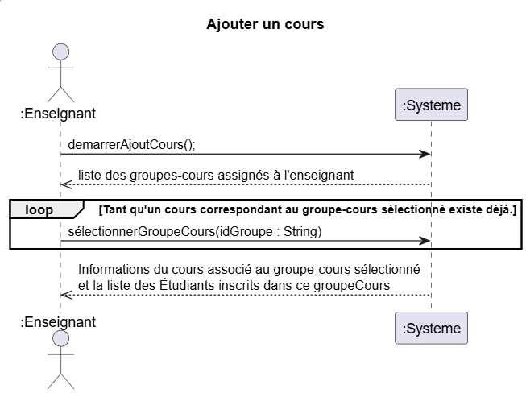

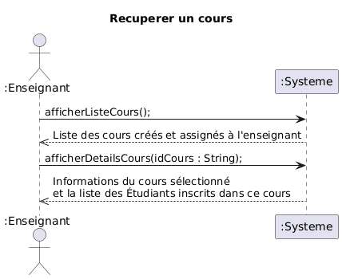

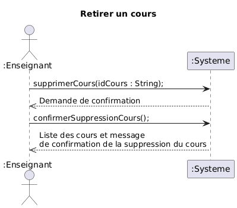

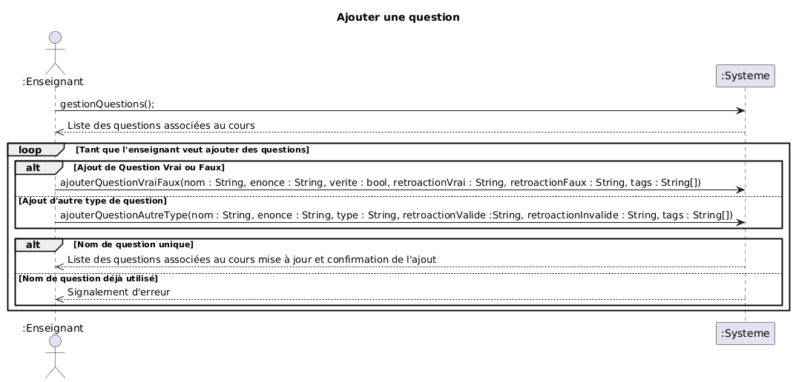

## Contrats
### Contrat CO01 - Démarrer Ajout Cours
---
**Opération:**
demarrerAjoutCours()

**Références croisées:**

**Préconditions:**
L'Enseignant doit être authentifié.
Le service SGB est accessible.

**PostConditions:**
L'Enseignant a été récupéré depuis le SGA la liste des groupes-cours.

### Contrat CO02 - Sélectionner Cours
---
**Opération:**
sélectionnerGroupeCours(idGroupe : String)

**Références croisées:**
Contrat CO01 - Démarrer Ajout Cours

**Préconditions:**
L'Enseignant est authentifié.
Un jeton d'authentification valide est présent dans la session.
La liste des groupes-cours assignés à l'Enseignant a été récupérée préalablement via demarrerAjoutCours()

**PostConditions:**
Une instance c : Cours a été créée.
c a été associée à l'Enseignant authentifié.
Les étudiants inscrit à ce groupe-cours étaient associés a c. 
Les informations du groupe-cours(horaire, local, etc.) ont étés enregistrées dans c.

### Contrat CO03 - Afficher la liste des cours
---
**Opération:**
afficherListeCours()

**Références croisées:**

**Préconditions:**
Une instance ens d'Enseignant existe.

**PostConditions:**

### Contrat CO04 - Afficher les détails d'un cours
---
**Opération:**
afficherDetailsCours(idCours: String)

**Références croisées:**

**Préconditions:** 
L'Enseignant a eu au moins un cours qui lui est assigné.

**PostConditions:** 

### Contrat CO05 - Retirer un cours
---
**Opération:**
retirerCours(idCours : String)

**Références croisées:**
Contrat CO03 - Afficher la liste des cours

**Préconditions:**
L'Enseignant est authentifié.
L'Enseignant a récupéré un cours (Cu01b)

**PostConditions:**
Le cours c a été associcé à idCours

### Contrat CO06 - Confirmation de la suppression d'un cours
---
**Opération:**
confirmerSuppressionCours()

**Références croisées:**
Contrat CO05 - Retirer un cours

**Préconditions:**
L'Enseignant est authentifié.
L'Enseignant a récupéré un cours (Cu01b)

**PostConditions:**
Le cours (et seulement ce cours) a été supprimé du système SGA

### Contrat CO07 - Gestion de Question
---
**Opération:**
gestionQuestions()

**Références croisées:**

**Préconditions:**
- Le token de l'Enseignant e.token n'est pas vide
- Un cours c est selectioné

**PostConditions:**

### Contrat CO08 - Ajouter une question vrai/faux
---
**Opération:**
ajouterQuestionVraiFaux(nom : String, énoncé : String, vérité : Boolean, rétroactionVrai : String, rétroactionFaux : String) : void

**Références croisées:**  
CU02a – Ajouter question  
DSS – Ajouter une question  
MDD – Question, Cours  

**Préconditions:**  
- L’Enseignant.token n'est pas vide.  
- Un cours c  est sélectionné.

**PostConditions:**  
- Une instance `qvf` de `Question` a été créée.  
- `qvf.nom` est devenu `nom`.  
- `qvf.énoncé` est devenu `énoncé`.  
- `qvf.vérité` est devenu `vérité`.  
- `qvf.rétroactionValide` est devenu `rétroactionVrai`.  
- `qvf.rétroactionInvalide` est devenu `rétroactionFaux`.  
- `qvf` a été associée au `Cours` courant via l’association *contient*.

### Contrat CO09 - Ajouter une question d'autre type
---
**Opération:**
ajouterQuestionAutreType(nom: String, énoncé: String, type: String, rétroactionValide: String, rétroactionInvalide: String, tags: String[])

**Références croisées:**
CU02a - Ajouter question
DSS - Ajoute une question
MDD - Questions, Cours

**Préconditions:**
- L'Enseignant est authentifié
- Un cours courant est sélectionné.  
- Le nom de la question n’existe pas déjà dans la banque de questions du cours courant.

**Postconditions:**
- Une instance `q` de `Question` a été créée
- `q.nom` est devenu `nom`
- `q.énoncé` est devenu `énoncé`
- `q.type` est devenu `type` (attribut indiquant le type de question)
- `q.rétroactionValide` est devenu `rétroactionValide`
- `q.rétroactionInvalide` est devenu `rétroactionInvalide`
- `q` a été associée au `Cours` courant via l'association *contient*
- Pour chaque élément `t` dans `tags`, une instance de `tags` a été créée ou récupérée et associée à `q` via l'association *catégorisé par*

## Réalisation de cas d'utilisation (RDCU)
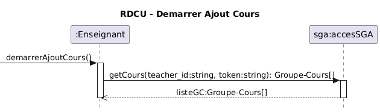

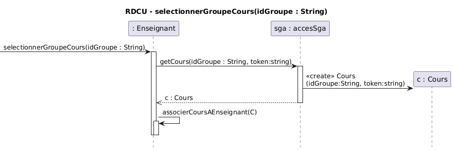

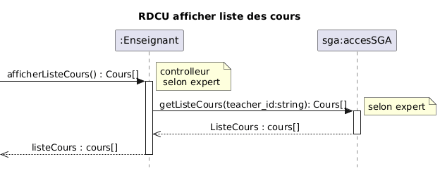

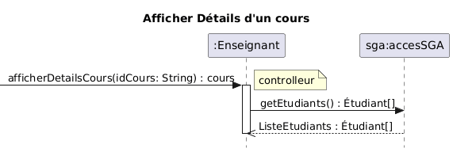

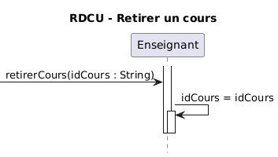

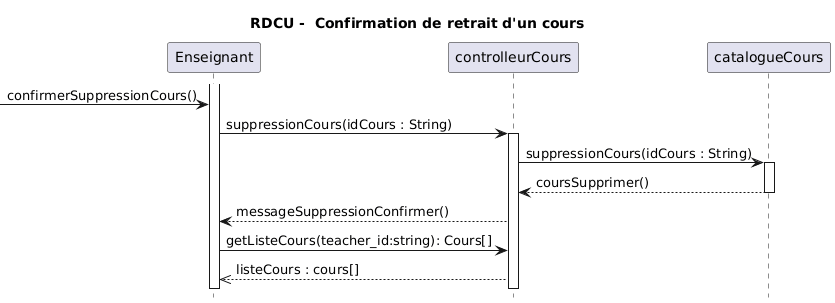

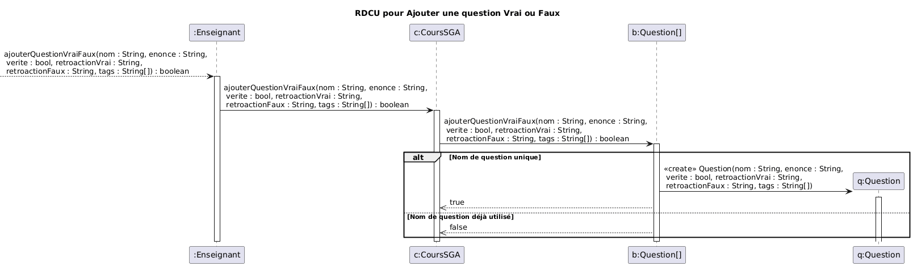

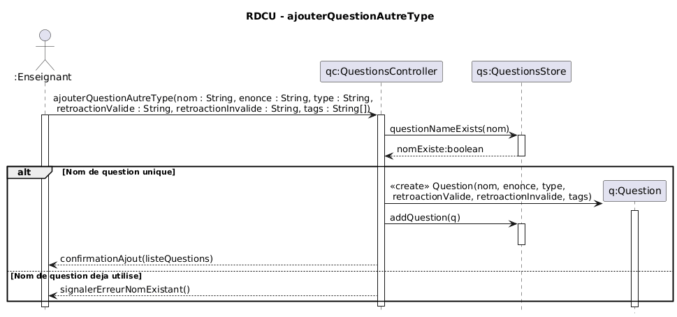

### Diagramme de classe TPLANT
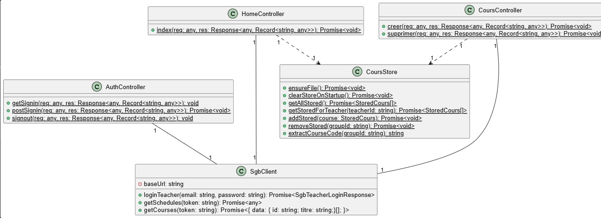
Il est possible de constater plusieurs différence entre notre MDD et notre diagramme de classes. La pluspart d'entre elles comme le AuthController sont causé par les accès avec le SGB. L'authentification qui doit être fait n'est pas non plus dans le mdd puisqu'il découle de la récupération de l'Enseignant dans le SGB.
  

## Vérification finale

- [X] Vous avez un seul MDD
  - [X] Vous avez mis un verbe à chaque association
  - [X] Chaque association a une multiplicité
- [X] Vous avez un DSS par cas d'utilisation
  - [X] Chaque DSS a un titre
  - [X] Chaque opération synchrone a un retour d'opération
  - [X] L'utilisation d'une boucle (LOOP) est justifiée par les exigences
- [X] Vous avez autant de contrats que d'opérations système (pour les cas d'utilisation nécessitant des contrats)
  - [X] Les postconditions des contrats sont écrites au passé
- [X] Vous avez autant de RDCU que d'opérations système
  - [X] Chaque décision de conception (affectation de responsabilité) est identifiée et surtout **justifiée** (par un GRASP ou autre heuristique)
  - [X] Votre code source (implémentation) est cohérent avec la RDCU (ce n'est pas juste un diagramme)
- [X] Vous avez un seul diagramme de classes
- [X] Vous avez remis la version PDF de ce document dans votre répertoire
- [X] [Vous avez regardé cette petite présentation pour l'architecture en couche et avez appliqué ces concepts](https://log210-cfuhrman.github.io/log210-valider-architecture-couches/#/) 
