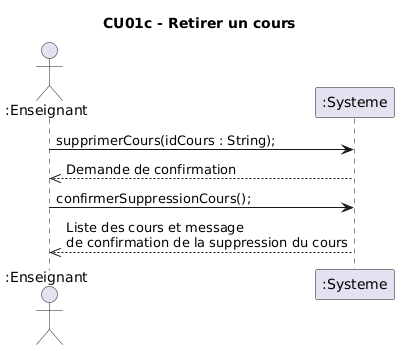

# Rapport Itération numéro 2

## Identification des membres de l'équipe

## Membre 1

- <nomComplet1>Ardy, Yahya</nomComplet1>
- <courriel1>yahya.ardy.1@ens.etsmtl.ca</courriel1>
- <codeMoodle1>AT73950</codeMoodle1>
- <githubAccount1>xMrYahya</githubAccount1>

## Membre 2

- <nomComplet2>Boulianne, Alex</nomComplet2>
- <courriel2>alex.boulianne.1@ens.etsmtl.ca</courriel2>
- <codeMoodle2>AT72810</codeMoodle2>
- <githubAccount2>c4tiki</githubAccount2>

## Membre 3

- <nomComplet3>Gamache, Alexandre</nomComplet3>
- <courriel3>alexandre.gamache.1@ens.etsmtl.ca</courriel3>
- <codeMoodle3>AU74150</codeMoodle3>
- <githubAccount3>AlexandreG17</githubAccount3>

## Membre 4

- <nomComplet4>Hoffmann, Raphaël</nomComplet4>
- <courriel4>raphael.hoffmann.1@ens.etsmtl.ca</courriel4>
- <codeMoodle4>AU65470</codeMoodle4>
- <githubAccount4>WishPib</githubAccount4>

## Membre 5

- <nomComplet5>Kandil, Kassem</nomComplet5>
- <courriel5>kassem.kandil.1@ens.etsmtl.ca</courriel5>
- <codeMoodle5>AU84220</codeMoodle5>
- <githubAccount5>kassem0303,kassem03-ets</githubAccount5>

## Exigences

| Exigence | Responsable |
| -------- | ----------- |
| Ajout des DSS et contrats d'operation des nouveaux CU | Alexandre Gamache
| Mise a jour du MDD | Alexandre Gamache |
| CU02b,c code, tests et RDCUs | Yahya Ardy, Alex Boulianne
| CU05a,b,c,d code, tests et RDCUs| Kassem Kandil, raphael hoffmann

## Modèle du domaine (MDD)

> Le MDD est cumulatif : vous devez y ajouter des éléments à chaque itération (ou corriger les erreurs), selon la portée (et votre meilleure compréhension du problème) visée par votre solution. 
> Utilisez une légende dans le MDD pour indiquer la couleur de chaque itération afin de faire ressortir les changements (ce n'est pas toujours possible pour les associations et les attributs). Voir les stéréotypes personnalisés : <https://plantuml.com/fr/class-diagram> et [comment faire une légende avec couleurs en PlantUML](https://stackoverflow.com/questions/30999290/how-to-generate-a-legend-with-colors-in-plantuml).

## Diagramme de séquence système (DSS)

## Contrats

### Contrat C010 - Afficher la liste de question d'un cours
---
**Opération: consulterQuestionsCours(groupId : String)**  
**Références croisées:**
- CU02b - Récuperer une question
- MDD - Enseignant, Cours, Question
- DSS - Récuperer Question
**Préconditions:**
- Un cours a été sélectionné

**PostConditions:**

### Contrat C011 - Afficher une question de la liste de question d'un cours
---
**Opération: selectionnerQuestionnaire(nom : String)**  
**Références croisées:**
- CU02b - Récuperer une question
- MDD - Enseignant, Cours, Question
- DSS - Récuperer Question
**Préconditions:**
- La liste de question d'un cours a été récupéré

**PostConditions:**
- Aucune post condition

### Contrat C012 - Demande de suppression de question
---
**Opération: supprimerQuestion(nom : String)**  
**Références croisées:**
- CU02d - Supprimer une question
- MDD - Enseignant, Cours, Question
- DSS - Supprimer question
**Préconditions:**
- Une liste de cours a été selectionné

**PostConditions:**
- Aucune post condition

### Contrat C013 - Confirmation de suppression de question
---
**Opération: confirmerSuppression()**  
**Références croisées:**
- CU02d - Supprimer une question
- MDD - Enseignant, Cours, Question
- DSS - Supprimer question
**Préconditions:**
- Une demande de suppression a été débuté pour un cours

**PostConditions:**
- La question de la selectionné a été dissocié du QuestionStore de la question selectionné

### Contrat C014 - Modification de question
---
**Opération: modifierQuestion(nom, enonce, type,retroactionValide, retroactionInvalide, tags)**  
**Références croisées:**
- CU02c - Modifier une question
- MDD - Enseignant, Cours, Question
- DSS - Modifier une question
**Préconditions:**
- Le nouveau nom de la question a modifier est valide
- Une question est sélectionné

**PostConditions:**
- nom a été associé dans Question.nom de la question sélectionné
- enonce a été associé dans Question.enonce de la question sélectionné
- type a été associé dans Question.type de la question sélectionné
- retroactionValide a été associé dans Question.retroactionValide de la question sélectionné
- retroactionInvalide a été associé dans Question.retroactionInvalide de la question sélectionné

### Contrat C015 - Gerer les questionnaires
---
**Opération: gererQuestionnaires()**  
**Références croisées:**
- CU05a - Ajouter un questionnaire
- MDD - Enseignant, Cours, Question
- DSS -Ajouter un questionnaire
**Préconditions:**
- Un cours est sélectionné

**PostConditions:**
- Aucune postCondition (les questionnaires sont seulement retourné par le controlleur)

### Contrat C016 - Ajouter un questionnaire
---
**Opération: ajouterQuestionnaire(nom:String, description:String, actif:boolean)**  
**Références croisées:**
- CU05a - Ajouter un questionnaire
- MDD - Enseignant, Cours, Question
- DSS -Ajouter un questionnaire
**Préconditions:**
- Un cours est sélectionné
- L'option ajouter Questionnaire a été selectionné

**PostConditions:**
- une instance q de questionnaire a été créé
- q a été associé au cours sélectionné
- nom a été assigné a q.nom
- description a été associé a q.description
- actif a été associé a q.actif

### Contrat C017 - Selectionner un tag
---
**Opération: selectionnerTag(nomTag:String)**  
**Références croisées:**
- CU05a - Ajouter un questionnaire
- MDD - Enseignant, Cours, Question
- DSS -Ajouter un questionnaire
**Préconditions:**
- Un tag a été selectionné

**PostConditions:**
- Une instance questionnaireTemp de Questionnaire a été crée

### Contrat C018 - Ajouter une question
---
**Opération: ajouterQuestion(nomQuestion:String)**  
**Références croisées:**
- CU05a - Ajouter un questionnaire
- MDD - Enseignant, Cours, Question
- DSS -Ajouter un questionnaire
**Préconditions:**
- Un questionnaire a été sélectionné

**PostConditions:**
- une question a été ajouté au questionnaireTemp avec la correspondance du nomQuestion

### Contrat C019 - Sauvegarder un questionnaire
---
**Opération: sauvegarderQuestionnaire()**  
**Références croisées:**
- CU05a - Ajouter un questionnaire
- MDD - Enseignant, Cours, Question
- DSS -Ajouter un questionnaire
**Préconditions:**
- Un questionnaire temporaire a été selectionné

**PostConditions:**
- une question a été ajouté au questionnaireTemp avec la correspondance du nomQuestion

## Réalisation de cas d'utilisation (RDCU)

> Chaque cas d'utilisation nécessite une RDCU.
> Vos RDCU doivent être des diagrammes de séquences d'opérations tel que vu dans le cours de LOG121.
> Vos diagrammes doivent inclurent: 
> - La création des instances nécessaires pour réaliser cette séquence
> - Toutes les objets et classes nécessaires pour réaliser cette séquences, incluant les structures de données comme des objets Map, List, Set, etc.
> - Les appels de méthodes avec leurs paramètres et les types (paramètres et méthodes)
> - Les valeurs de retour avec leur type
> - L'ordre chronologique précis des messages
> - Les barres d'activation des instances pour montrer quand chaque objet est actif

## Diagramme de classe logicielle (DCL)

> Facultatif, mais fortement suggéré
> Ce diagramme vous aidera à planifier l'ordre d'implémentation des classes.  Très utile lorsqu'on utilise TDD.

### Diagramme de classe TPLANT
- Générer un diagramme de classe avec l'outil TPLANT et commenter celui-ci par rapport à votre MDD.
- https://www.npmjs.com/package/tplant
  
## Retour sur la correction du rapport précédent

## DSS Mis à Jour
Les dss suivant ont été mis a jout afin de corriger les erreurs qui avait été trouvé durant l'itération précédente. (Titres de cu manquants dans le titre et types de questions différents pas pris en compte dans le dss)

## Contrats Mis à Jour

### Contrat CO01 - Démarrer Ajout d'un Cours
---
Les références croisées ont été ajoutés, précisé la forme de la liste

**Opération:**
demarrerAjoutCours()

**Références croisées:**
- CU01a - Ajouter un cours
- DSS - Ajouter un cours
- MDD - Enseignant, Cours

**Préconditions:**
- L'Enseignant doit être authentifié.
- Le service SGB est accessible.

**PostConditions:**
HomeController.listeCours contiens la liste des cours associé a l'enseignant authentifié (Array de GroupeCoursSGA) 

### Contrat CO02 - Sélectionner un Cours
---
Les références croisées ont été ajoutés,

**Opération:**
sélectionnerGroupeCours(idGroupe : String)

**Références croisées:**
- Contrat CO01 - Démarrer Ajout Cours
- CU01a - Ajouter un cours
- DSS - Ajouter un cours
- MDD - Enseignant, Cours

**Préconditions:**
- L'Enseignant est authentifié.
- Un jeton d'authentification valide est présent dans la session.
- La liste des groupes-cours assignés à l'Enseignant a été récupérée préalablement via demarrerAjoutCours()

**PostConditions:**
- Une instance c : Cours a été créée.
- c a été associée à l'Enseignant authentifié.
- Les étudiants inscrit à ce groupe-cours étaient associés a c. 
- Les informations du groupe-cours(horaire, local, etc.) ont étés enregistrées dans c.

### Contrat CO03 - Afficher la liste des cours
---
**Opération:**
afficherListeCours()

**Références croisées:**

**Préconditions:**
Une instance ens d'Enseignant existe.

**PostConditions:**

### Contrat CO04 - Afficher les détails d'un cours
---
**Opération:**
afficherDetailsCours(idCours: String)

**Références croisées:**

**Préconditions:** 
L'Enseignant a eu au moins un cours qui lui est assigné.

**PostConditions:** 

### Contrat CO05 - Retirer un cours
---
**Opération:**
retirerCours(idCours : String)

**Références croisées:**
Contrat CO03 - Afficher la liste des cours

**Préconditions:**
L'Enseignant est authentifié.
L'Enseignant a récupéré un cours (Cu01b)

**PostConditions:**
Le cours c a été associcé à idCours

### Contrat CO06 - Confirmation de la suppression d'un cours
---
**Opération:**
confirmerSuppressionCours()

**Références croisées:**
Contrat CO05 - Retirer un cours

**Préconditions:**
L'Enseignant est authentifié.
L'Enseignant a récupéré un cours (Cu01b)

**PostConditions:**
Le cours (et seulement ce cours) a été supprimé du système SGA

### Contrat CO07 - Gestion de Question
Le contrat est suprimé puisque la fonction n'existe plus

### Contrat CO08 - Ajouter une question vrai/faux
---
**Opération:**
ajouterQuestionVraiFaux(nom : String, énoncé : String, vérité : Boolean, rétroactionVrai : String, rétroactionFaux : String) : void

**Références croisées:**  
CU02a – Ajouter question  
DSS – Ajouter une question  
MDD – Question, Cours  

**Préconditions:**  
- L’Enseignant.token n'est pas vide.  
- Un cours c  est sélectionné.

**PostConditions:**  
- Une instance `qvf` de `Question` a été créée.  
- `qvf.nom` est devenu `nom`.  
- `qvf.énoncé` est devenu `énoncé`.  
- `qvf.vérité` est devenu `vérité`.  
- `qvf.rétroactionValide` est devenu `rétroactionVrai`.  
- `qvf.rétroactionInvalide` est devenu `rétroactionFaux`.  
- `qvf` a été associée au `Cours` courant via l’association *contient*.

### Contrat CO09 - Ajouter une question d'autre type
---
**Opération:**
ajouterQuestionAutreType(nom: String, énoncé: String, type: String, rétroactionValide: String, rétroactionInvalide: String, tags: String[])

**Références croisées:**
CU02a - Ajouter question
DSS - Ajoute une question
MDD - Questions, Cours

**Préconditions:**
- L'Enseignant est authentifié
- Un cours courant est sélectionné.  
- Le nom de la question n’existe pas déjà dans la banque de questions du cours courant.

**Postconditions:**
- Une instance `q` de `Question` a été créée
- `q.nom` est devenu `nom`
- `q.énoncé` est devenu `énoncé`
- `q.type` est devenu `type` (attribut indiquant le type de question)
- `q.rétroactionValide` est devenu `rétroactionValide`
- `q.rétroactionInvalide` est devenu `rétroactionInvalide`
- `q` a été associée au `Cours` courant via l'association *contient*
- Pour chaque élément `t` dans `tags`, une instance de `tags` a été créée ou récupérée et associée à `q` via l'association *catégorisé par*

> Veuillez insérer ici les diagrammes à revalider de l'itération précédente avec les corrections apportées.
> Démontrer que vous avez réglé les problèmes identifiés dans le rapport de l'itération précédente.

## Vérification finale

- [ ] Vous avez un seul MDD
  - [ ] Vous avez mis un verbe à chaque association
  - [ ] Chaque association a une multiplicité
- [X] Vous avez un DSS par cas d'utilisation
  - [X] Chaque DSS a un titre
  - [X] Chaque opération synchrone a un retour d'opération
  - [X] L'utilisation d'une boucle (LOOP) est justifiée par les exigences
- [ ] Vous avez autant de contrats que d'opérations système (pour les cas d'utilisation nécessitant des contrats)
  - [ ] Les postconditions des contrats sont écrites au passé
- [ ] Vous avez autant de RDCU que d'opérations système
  - [ ] Chaque décision de conception (affectation de responsabilité) est identifiée et surtout **justifiée** (par un GRASP ou autre heuristique)
  - [ ] Votre code source (implémentation) est cohérent avec la RDCU (ce n'est pas juste un diagramme)
- [ ] Vous avez un seul diagramme de classes
- [ ] Vous avez remis la version PDF de ce document dans votre répertoire
- [X] [Vous avez regardé cette petite présentation pour l'architecture en couche et avez appliqué ces concepts](https://log210-cfuhrman.github.io/log210-valider-architecture-couches/#/) 
