# Rapport Itération numéro 2

## Identification des membres de l'équipe

## Membre 1

- <nomComplet1>Ardy, Yahya</nomComplet1>
- <courriel1>yahya.ardy.1@ens.etsmtl.ca</courriel1>
- <codeMoodle1>AT73950</codeMoodle1>
- <githubAccount1>xMrYahya</githubAccount1>

## Membre 2

- <nomComplet2>Boulianne, Alex</nomComplet2>
- <courriel2>alex.boulianne.1@ens.etsmtl.ca</courriel2>
- <codeMoodle2>AT72810</codeMoodle2>
- <githubAccount2>c4tiki</githubAccount2>

## Membre 3

- <nomComplet3>Gamache, Alexandre</nomComplet3>
- <courriel3>alexandre.gamache.1@ens.etsmtl.ca</courriel3>
- <codeMoodle3>AU74150</codeMoodle3>
- <githubAccount3>AlexandreG17</githubAccount3>

## Membre 4

- <nomComplet4>Hoffmann, Raphaël</nomComplet4>
- <courriel4>raphael.hoffmann.1@ens.etsmtl.ca</courriel4>
- <codeMoodle4>AU65470</codeMoodle4>
- <githubAccount4>WishPib</githubAccount4>

## Membre 5

- <nomComplet5>Kandil, Kassem</nomComplet5>
- <courriel5>kassem.kandil.1@ens.etsmtl.ca</courriel5>
- <codeMoodle5>AU84220</codeMoodle5>
- <githubAccount5>kassem0303,kassem03-ets</githubAccount5>

## Exigences

| Exigence | Responsable |
| -------- | ----------- |
| Ajout des DSS et contrats d'operation des nouveaux CU | Alexandre Gamache
| Mise a jour du MDD | Alexandre Gamache |
| CU02b,c code, tests et RDCUs | Yahya Ardy, Alex Boulianne
| CU05a,b,c,d code, tests et RDCUs| Kassem Kandil, raphael hoffmann

## Modèle du domaine (MDD)

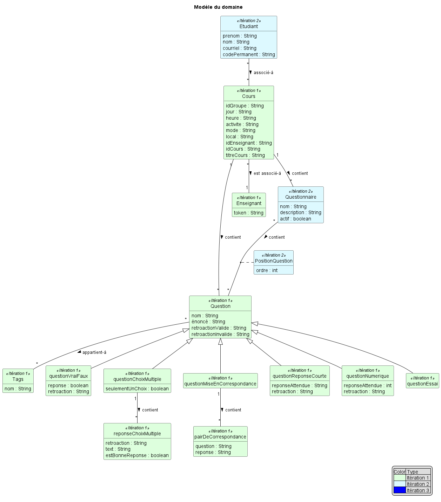

## Diagramme de séquence système (DSS)

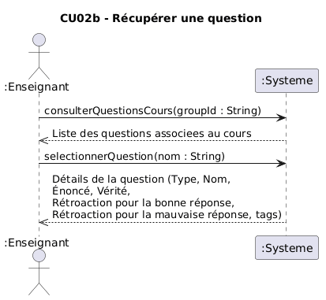

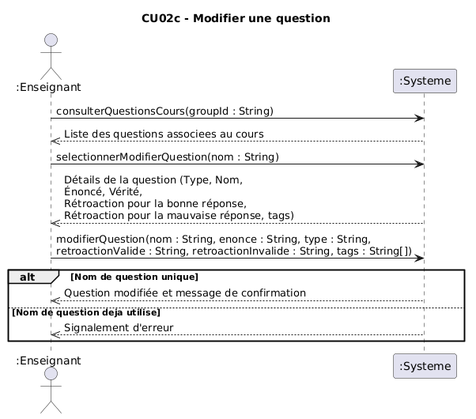

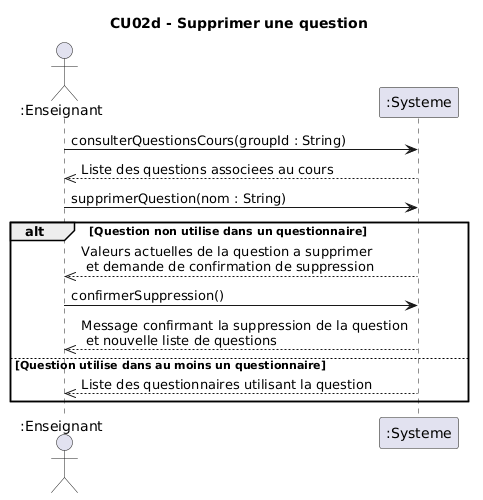

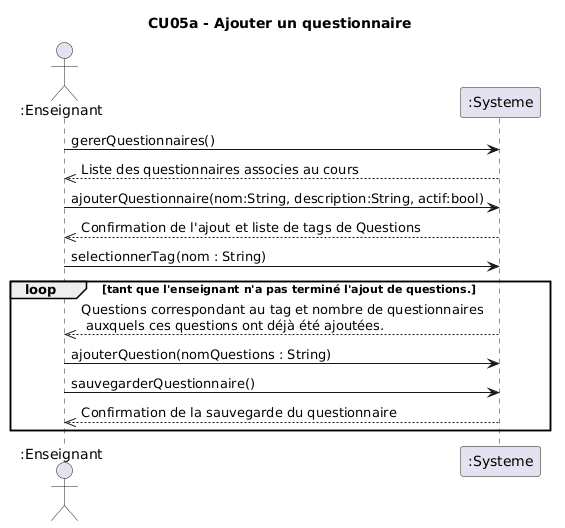

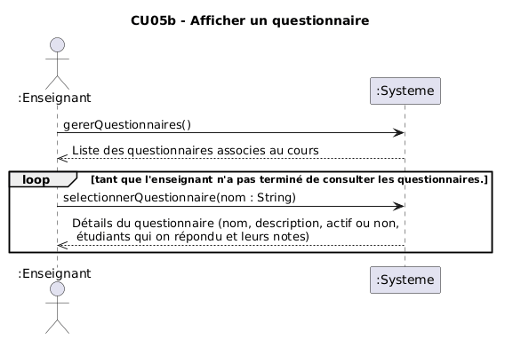

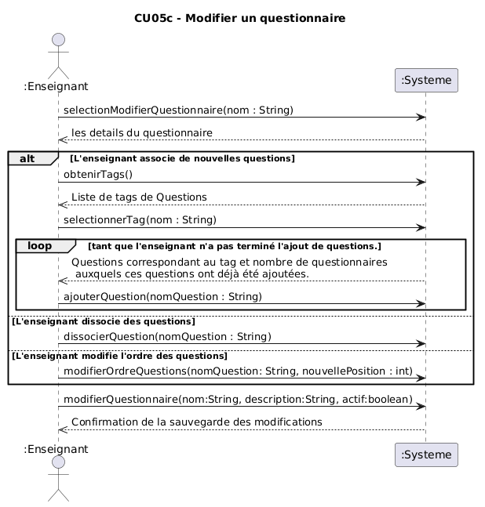

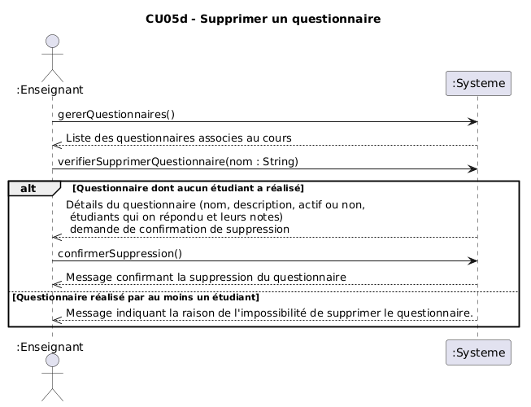

## Contrats

### Contrat CO10 - Afficher la liste de question d'un cours
---
**Opération: consulterQuestionsCours(groupId : String)**  
**Références croisées:**
- CU02b - Récuperer une question
- MDD - Enseignant, Cours, Question
- DSS - Récuperer Question
**Préconditions:**
- Un cours est sélectionné

**PostConditions:**
- Aucune postcondition

### Contrat CO11 - Afficher une question de la liste de question d'un cours
---
**Opération: selectionnerQuestion(nom : String)**  
**Références croisées:**
- CU02b - Récuperer une question
- MDD - Enseignant, Cours, Question
- DSS - Récuperer Question
**Préconditions:**
- La liste de question d'un cours est récupéré

**PostConditions:**
- Aucune postcondition

### Contrat CO12 - Demande de suppression de question
---
**Opération: supprimerQuestion(groupId : String, nom : String)**  
**Références croisées:**
- CU02d - Supprimer une question
- MDD - Enseignant, Cours, Question
- DSS - Supprimer question
**Préconditions:**
- Une liste de cours est selectionné

**PostConditions:**
- Aucune post condition

### Contrat CO13 - Confirmation de suppression de question
---
**Opération: confirmerSuppression()**  
**Références croisées:**
- CU02d - Supprimer une question
- MDD - Enseignant, Cours, Question
- DSS - Supprimer question
**Préconditions:**
- Une demande de suppression est débuté pour un cours

**PostConditions:**
- La question selectionné a été dissocié du Cours à laquelle il était relié
- La question selectionné a été supprimée

### Contrat CO14 - Modification de question
---
**Opération: modifierQuestion(nom : String, enonce, type,retroactionValide, retroactionInvalide, tags)**  
**Références croisées:**
- CU02c - Modifier une question
- MDD - Enseignant, Cours, Question
- DSS - Modifier une question
**Préconditions:**
- Le nouveau nom de la question a modifier est valide
- Une question est sélectionné

**PostConditions:**
- nom a été associé dans Question.nom de la question sélectionné
- enonce a été associé dans Question.enonce de la question sélectionné
- type a été associé dans Question.type de la question sélectionné
- retroactionValide a été associé dans Question.retroactionValide de la question sélectionné
- retroactionInvalide a été associé dans Question.retroactionInvalide de la question sélectionné

### Contrat CO15 - Gerer les questionnaires
---
**Opération: gererQuestionnaires()**  
**Références croisées:**
- CU05a - Ajouter un questionnaire
- MDD - Enseignant, Cours, Question
- DSS -Ajouter un questionnaire
**Préconditions:**
- Un cours est sélectionné

**PostConditions:**
- Aucune postCondition (les questionnaires sont seulement retourné par le controlleur)

### Contrat CO16 - Ajouter un questionnaire
---
**Opération: ajouterQuestionnaire(nom:String, description:String, actif:boolean)**  
**Références croisées:**
- CU05a - Ajouter un questionnaire
- MDD - Enseignant, Cours, Question
- DSS -Ajouter un questionnaire
**Préconditions:**
- Un cours est sélectionné
- L'option ajouter Questionnaire est selectionné

**PostConditions:**
- une instance q de questionnaire a été créé
- q a été associé au cours sélectionné
- nom a été assigné a q.nom
- description a été associé a q.description
- actif a été associé a q.actif

### Contrat CO17 - Selectionner un tag
---
**Opération: selectionnerTag(nomTag:String)**  
**Références croisées:**
- CU05a - Ajouter un questionnaire
- MDD - Enseignant, Cours, Question
- DSS -Ajouter un questionnaire
**Préconditions:**
- Un questionnaire a été selectionné

**PostConditions:**
- Une instance questionnaireTemp de Questionnaire a été crée

### Contrat CO18 - Ajouter une question
---
**Opération: ajouterQuestion(nomQuestion:String)**  
**Références croisées:**
- CU05a - Ajouter un questionnaire
- MDD - Enseignant, Cours, Question
- DSS -Ajouter un questionnaire

**Préconditions:**
- Un questionnaire est sélectionné

**PostConditions:**
- une question a été ajouté au questionnaireTemp avec la correspondance du nomQuestion

### Contrat CO19 - Sauvegarder un questionnaire
---
**Opération: sauvegarderQuestionnaire()**  
**Références croisées:**
- CU05a - Ajouter un questionnaire
- MDD - Enseignant, Cours, Question
- DSS -Ajouter un questionnaire

**Préconditions:**
- Un questionnaire temporaire est selectionné

**PostConditions:**
- une question a été ajouté au questionnaireTemp avec la correspondance du nomQuestion

### Contrat CO20 - Sélectionner une question a modifier
---

**Opération: selectionnerModifierQuestion(groupId: String, nom: String)**
**Références croisées:**
- CU02c - Modifier un questionnaire
- DSS - Modifier un questionnaire

**Préconditions:**
- L'enseignant est authentifié
- Un cours est sélectionné

**Postconditions:**
- Aucune postcondition (les informations de la question ont été récupéré et affiché)

### Contrat CO21 - Sélectionner un questionnaire
---

**Opération: selectionnerQuestionnaire(nom : String)**
**Références croisées:**
- CU05b - Afficher un questionnaire
- DSS - Afficher un questionnaire
- CO15 - Gérer les questionnaires

**Préconditions:**
- Aucune précondition

**PostConditions:**
- Aucune postcondition (les détails du questionnaire sélectionné sont affiché)

### Contrat CO22 - Sélectionner un questionnaire a modifier
---

**Opération: selectionModifierQuestionnaire(nom : String)**
**Références croisées:**
- CU05c - Modifier un questionnaire
- DSS - Modifier un questionnaire
- CO15 - Gérer les questionnaires

**Préconditions:**
- L'enseignant est authentifié
- L'enseignant appuie sur gérer les questionnaires

**Postconditions:**
- tout les attributs de questionnaieTemp ont pris les valeurs de celui du questionnaire q

### Contrat CO23 - Obtenir les tags
---

**Opération: obtenirTags()**
**Références croisées:**
- CU05c - Modifier un questionnaire
- DSS - Modifier un questionnaire
- CO22 Sélectionner un questionnaire a modifier

**Préconditions:**
- Un questionnaire est sélectionné avec selectionModifierQuestionnaire(nom : String)

**Postconditions:**
- Aucun postcondition (la liste des tags a été affiché)

### Contrat CO24 - dissocier une question
---

**Opération: dissocierQuestion(nomQuestion : String)**
**Références croisées:**
- CU05c - Modifier un questionnaire
- DSS - Modifier un questionnaire

**Préconditions:**
- Un questionnaire est sélectionné avec selectionModifierQuestionnaire(nom : String)

**Postconditions:**
- la question avec le nom nomQuestion a été dissocié de questionnaireTemp.questions

### Contrat CO25 - Modifier l'ordre d'une question
---

**Opération: modifierOrdreQuestion(nomQuestion:String, nouvellePosition:int)**

**Référence croisées:**
- CU05c - Modifier un questionnaire
- DSS - Modifier un questionnaire

**Préconditions:**
- Le questionnaire a au moins deux questions d'associé
- La nouvelle position doit etre plus petite ou égale au nombre de questions dans le questionnaire

**PostConditions:**
- la question avec le nom nomQuestion a été associé à questionnaireTemp.question[nouvellePosition]

### Contrat CO26 - Modifier un questionnaire
---

**Opération: modifierQuestionnaire(nom:String, description: String, actif:boolean)**

**Références croisées:**
- CU05c - Modifier un questionnaire
- DSS - Modifier un questionnaire

**Préconditions:**
- le nouveau nom du questionnaire n'est pas déja utilisé

**Postconditions:**
- questionnaireTemp.nom est devenu nom
- questionnaireTemp.description est devenu description 
- questionnaireTemp.actif est devenu actif

### Contrat CO27 - Verifier pour supprimer un questionnaire
---

**Opération: verifierSupprimerQuestionnaire(nom:String)**

**Références croisées:**
- CU05d - Supprimer un questionnaire
- DSS - Supprimer un questionnaire

**Préconditions:**
- Aucune précondition

**Postconditions:**
- Aucune postcondition

### Contrat CO28 - Supprimer un questionnaire
---

**Opération: confirmerSuppression()**

**Références croisées:**
- CU05d - Supprimer un questionnaire
- DSS - Supprimer un questionnaire

**Préconditions:**
- vérifierSupprimerQuestionnaire a été effectué avec succes sur le questionnaire qui doit être supprimé

**Postconditions:**
- le questionnaire qui doit être supprimé est effacé

## Réalisation de cas d'utilisation (RDCU)

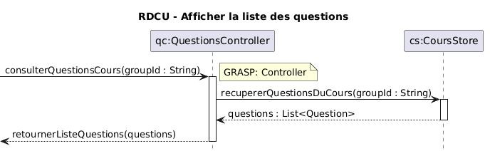

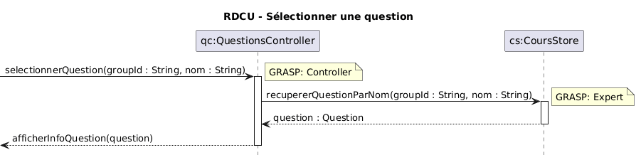

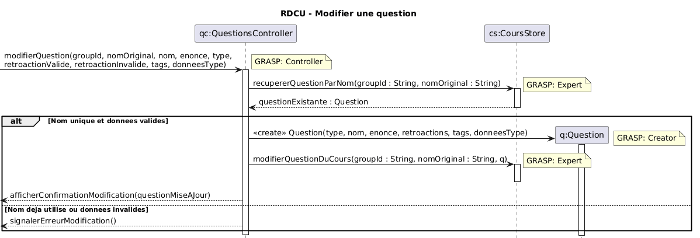

")

")

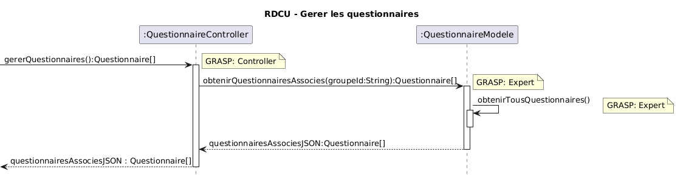

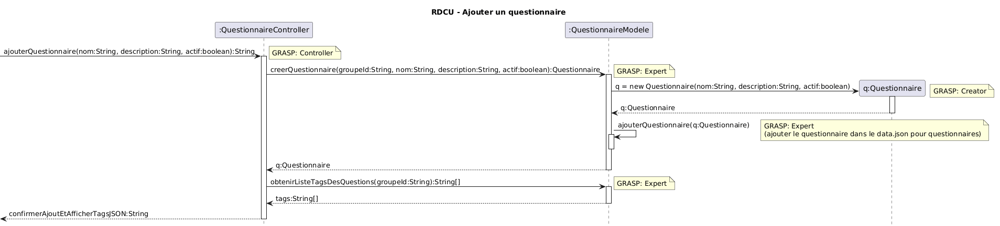

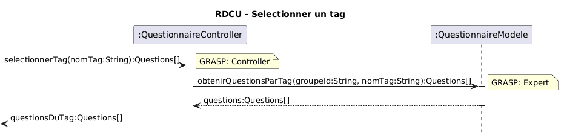

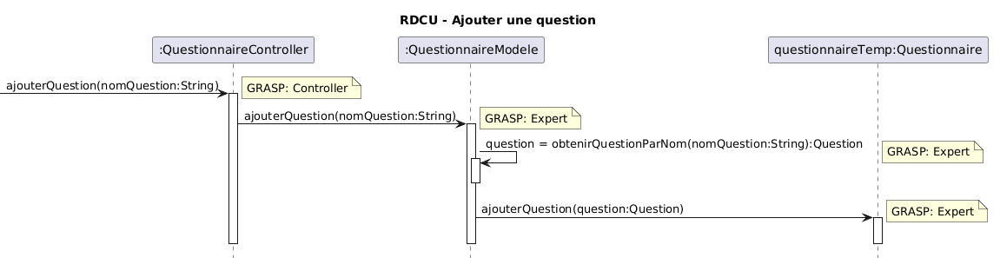

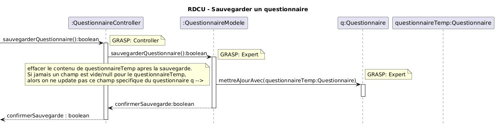

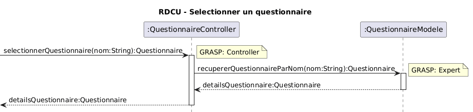

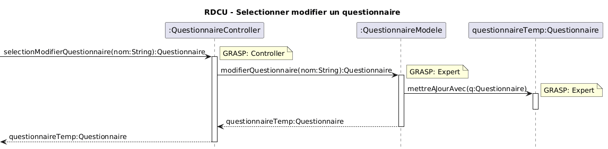

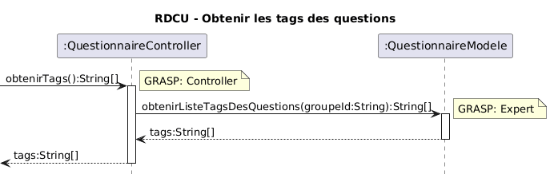

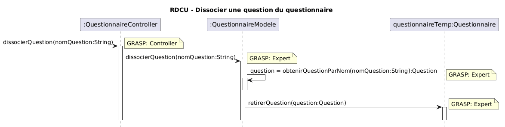

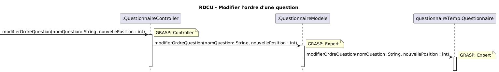

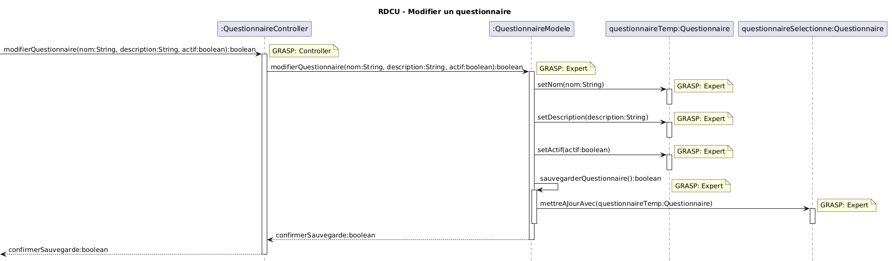

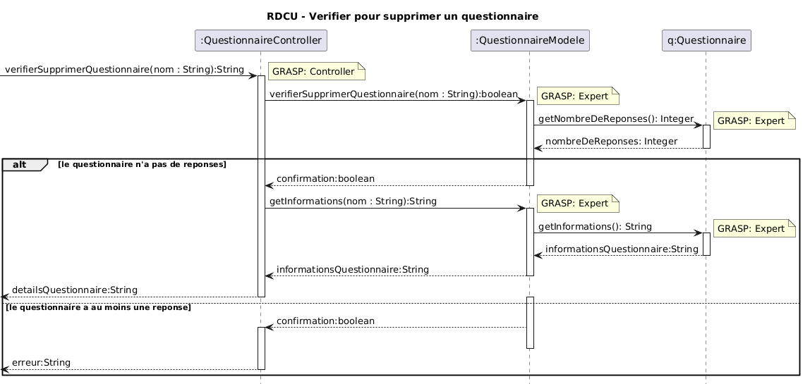

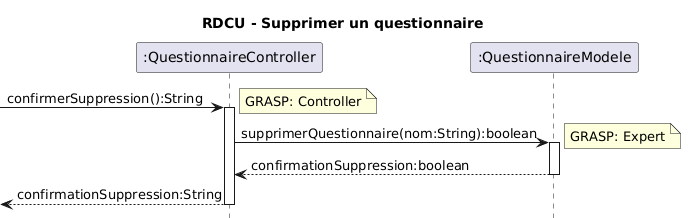

## Diagramme de classe logicielle (DCL)

### Diagramme de classe TPLANT
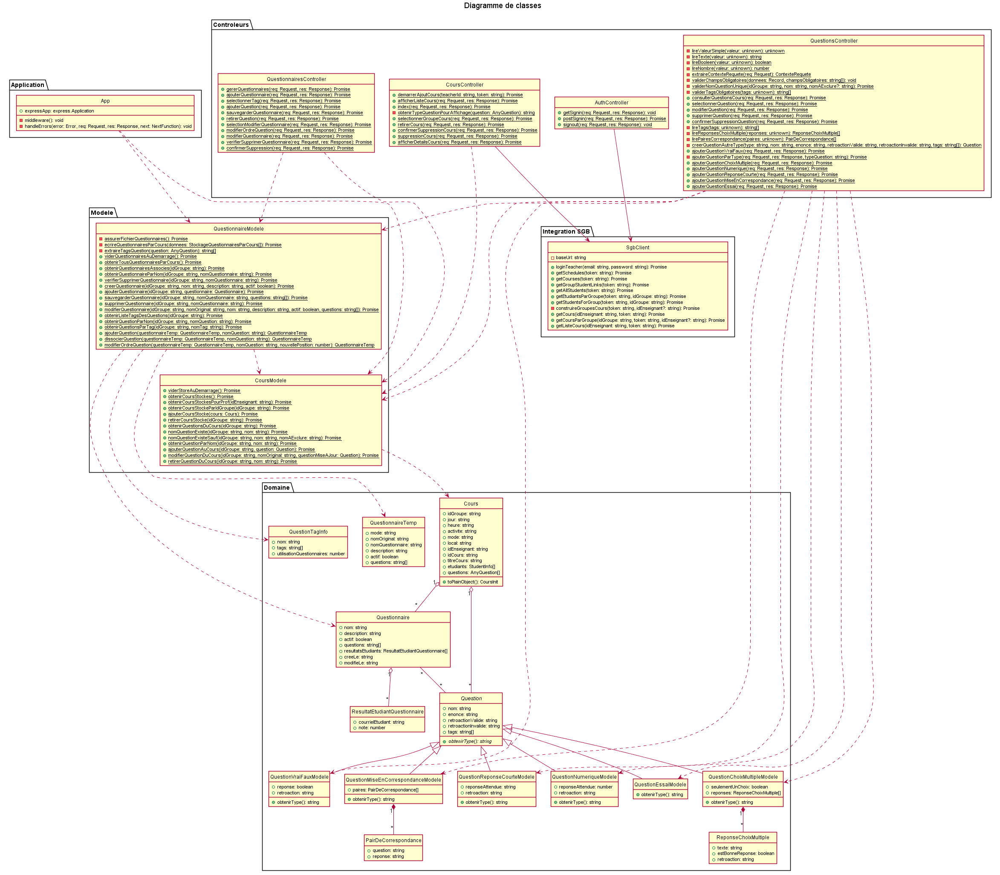

On peut voir que les différences les plus grandes avec proviennent des distinctions dans les chouches MVC avec les modeles et les controlleurs. Il est aussi possible de voir que les noms des fonctions dans les objets correspondent avec les RDCU et les dss
  
## Retour sur la correction du rapport précédent

## DSS Mis à Jour
Les dss suivant ont été mis a jout afin de corriger les erreurs qui avait été trouvé durant l'itération précédente. (Titres de cu manquants dans le titre et types de questions différents pas pris en compte dans le dss)

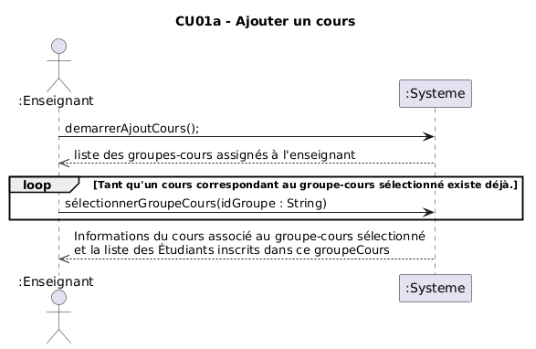

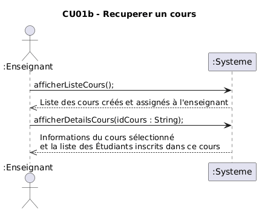

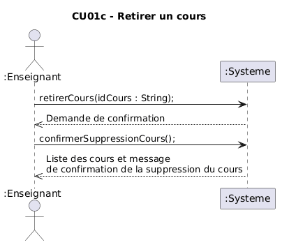

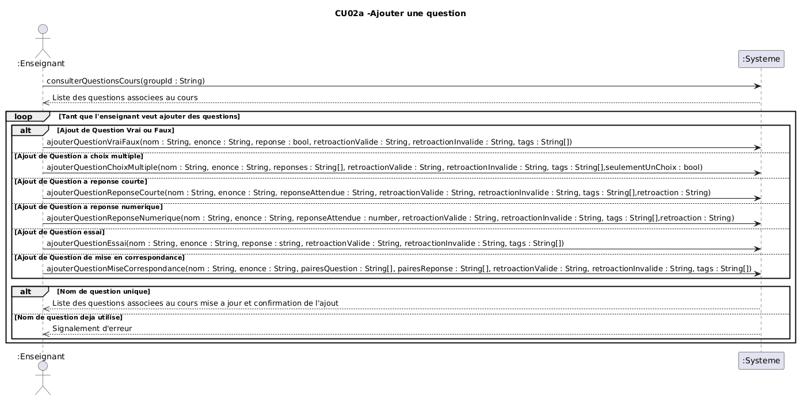

## Contrats Mis à Jour

### Contrat CO01 - Démarrer Ajout d'un Cours
---
Les références croisées ont été ajoutés, précisé la forme de la liste

**Opération:**
demarrerAjoutCours()

**Références croisées:**
- CU01a - Ajouter un cours
- DSS - Ajouter un cours

**Préconditions:**
- L'Enseignant doit être authentifié.
- Le service SGB est accessible.

**PostConditions:**
HomeController.listeCours contiens la liste des cours associé a l'enseignant authentifié (Array de GroupeCoursSGA) 

### Contrat CO02 - Sélectionner un Cours
---
Les références croisées ont été ajoutés,Précisé ce qui est associé au cours (information de l'étudiant en provenance de)

**Opération:**
sélectionnerGroupeCours(idGroupe : String)

**Références croisées:**
- Contrat CO01 - Démarrer Ajout Cours
- CU01a - Ajouter un cours
- DSS - Ajouter un cours

**Préconditions:**
- L'Enseignant est authentifié.
- Un jeton d'authentification valide est présent dans la session.
- La liste des groupes-cours assignés à l'Enseignant a été récupérée préalablement via demarrerAjoutCours()

**PostConditions:**
- Une instance c : Cours a été créée.
- c a été associée à l'Enseignant authentifié.
- Les Informations des étudiants (InfoEtudiant) inscrit à ce groupe-cours étaient associés a c. 
- Les informations du groupe-cours(horaire, local, etc.) ont étés enregistrées dans c.

### Contrat CO03 - Afficher la liste des cours
---
Les références croisées ont été ajoutés, précisé l'instance dans la précondition
**Opération:**
afficherListeCours()

**Références croisées:**
- CU01b afficher les détails d'un cours
- DSS récuperer cours

**Préconditions:**

- L'Enseignant est authentifié.
- Un jeton d'authentification valide est présent dans la session

**PostConditions:**

### Contrat CO04 - Afficher les détails d'un cours
---
Les références croisées ont été ajoutés, précondition au présent

**Opération:**
afficherDetailsCours(idCours: String)

**Références croisées:**
- CU01b afficher les détails d'un cours
- DSS récuperer cours

**Préconditions:** 
- L'Enseignant a au moins un cours qui lui est assigné.

**PostConditions:** 

### Contrat CO05 - Retirer un cours
---
Les références croisées ont été ajoutés, Le nom de l'operation a été modifié dans le DSS, la postcondition a été supprimé (le cours récupéré est celui qui sera effacé dans l'operation suivante)

**Opération:**
retirerCours(idCours : String)

**Références croisées:**
- Contrat CO03 - Afficher la liste des cours
- CU01c retirer un cours
- DSS retirer un cours

**Préconditions:**
L'Enseignant est authentifié.
L'Enseignant a récupéré un cours (Cu01b)

**PostConditions:**

### Contrat CO06 - Confirmation de la suppression d'un cours
---
Les références croisées ont été ajoutés

**Opération:**
confirmerSuppressionCours()

**Références croisées:**
- Contrat CO05 - Retirer un cours
- CU01c retirer un cours
- DSS retirer un cours

**Préconditions:**
L'Enseignant est authentifié.
L'Enseignant a récupéré un cours (Cu01b)

**PostConditions:**
Le cours (et seulement ce cours) a été supprimé du système SGA

### Contrat CO07 - Gestion de Question
Le contrat est suprimé puisque la fonction n'existe plus

### Contrat CO08 - Ajouter une question vrai/faux
Les références croisées ont été ajoutés,les tags ont été ajouté dans la déclaration

---
**Opération:**
ajouterQuestionVraiFaux(nom : String, enonce : String, reponse : bool, retroactionValide : String, retroactionInvalide : String, tags : String[]) : void

**Références croisées:**  
CU02a – Ajouter question  
DSS – Ajouter une question  
MDD – Question, Cours  

**Préconditions:**  
- L’Enseignant.token n'est pas vide.  
- Un cours c  est sélectionné.

**PostConditions:**  
- Une instance `qvf` de `Question` a été créée.  
- `qvf.nom` est devenu `nom`.  
- `qvf.énoncé` est devenu `énoncé`.  
- `qvf.vérité` est devenu `vérité`.  
- `qvf.rétroactionValide` est devenu `rétroactionVrai`.  
- `qvf.rétroactionInvalide` est devenu `rétroactionFaux`.  
- `qvf` a été associée au `Cours` courant via l’association *contient*.

### Contrat CO09 - Ajouter une question d'autre type
Les références croisées ont été ajoutés,les tags ont été ajouté dans la déclaration

---
**Opération:**
ajouterQuestionChoixMultiple(nom : String, enonce : String, reponses : String[], retroactionValide : String, retroactionInvalide : String, tags : String[],seulementUnChoix : bool)

**Références croisées:**
CU02a - Ajouter question
DSS - Ajouter une question
MDD - Questions, Cours

**Préconditions:**
- L'Enseignant est authentifié
- Un cours courant est sélectionné.  
- Le nom de la question n’existe pas déjà dans la banque de questions du cours courant.

**Postconditions:**
- Une instance `q` de `Question` a été créée
- `q.nom` est devenu `nom`
- `q.énoncé` est devenu `énoncé`
- `q.type` est devenu `type` (attribut indiquant le type de question)
- `q.rétroactionValide` est devenu `rétroactionValide`
- `q.rétroactionInvalide` est devenu `rétroactionInvalide`
- `q` a été associée au `Cours` courant via l'association *contient*
- Pour chaque élément `t` dans `tags`, une instance de `tags` a été créée ou récupérée et associée à `q` via l'association *catégorisé par*

## Vérification finale

- [X] Vous avez un seul MDD
  - [X] Vous avez mis un verbe à chaque association
  - [X] Chaque association a une multiplicité
- [X] Vous avez un DSS par cas d'utilisation
  - [X] Chaque DSS a un titre
  - [X] Chaque opération synchrone a un retour d'opération
  - [X] L'utilisation d'une boucle (LOOP) est justifiée par les exigences
- [ ] Vous avez autant de contrats que d'opérations système (pour les cas d'utilisation nécessitant des contrats)
  - [ ] Les postconditions des contrats sont écrites au passé
- [ ] Vous avez autant de RDCU que d'opérations système
  - [ ] Chaque décision de conception (affectation de responsabilité) est identifiée et surtout **justifiée** (par un GRASP ou autre heuristique)
  - [ ] Votre code source (implémentation) est cohérent avec la RDCU (ce n'est pas juste un diagramme)
- [ ] Vous avez un seul diagramme de classes
- [ ] Vous avez remis la version PDF de ce document dans votre répertoire
- [X] [Vous avez regardé cette petite présentation pour l'architecture en couche et avez appliqué ces concepts](https://log210-cfuhrman.github.io/log210-valider-architecture-couches/#/) 
