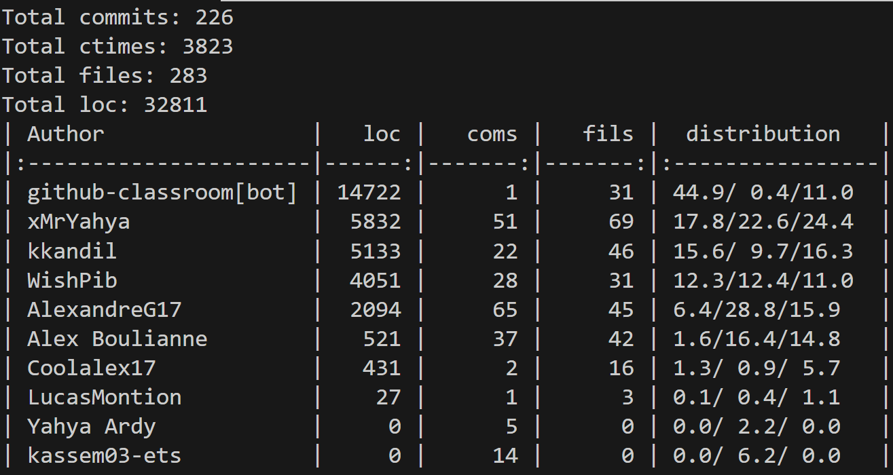

# Plan d'itération 3

## Étapes jalons

| Étape jalon          | Date       |
| :------------------- | :--------- |
| Début de l'itération | 2026/03/16 |
| Démo (séance 5)      | 2026/04/13 |
| Fin de l'itération   | 2019/04/13 |

## Objectifs clés

- Présenter une démonstration technique de CU08 avec tests.
- Mettre à jour la documentation
- Régler le décalage entre le code et les modèles

## Affectations d'éléments de travail

Les éléments de travail suivants seront abordés dans cette itération:

| Nom / Description                | Priorité | [Taille estimée (points)](#commentEstimer "Comment estimer?") | Assigné à (nom) | Documents de référence |
| -------------------------------- | -------: | --------------------------: | ------------------- | ---------------------- |
| CU08                             | 1        | 1                           | (tous)              | Exigences pour le lab  |
|   CU08 - conception              |          |                             | Raphael + Alexandre |                        |
|   CU08 - test et implémentation  |          |                             | Kassem + Yahya      |                        |
|   CU08 - mise à jour des modèles |          |                             | Alex                |                        |

## Problèmes

| Problème                                                                                                    | Notes |
| ----------------------------------------------------------------------------------------------------------- | ----- |
| L'équipe avait planifié ses implémentations pour une équipe de 6, mais nous sommes devenus une équipe de 5  |       |
| Certains tests échouent encore ou doivent être corrigés                                                     |       |

## Critères d'évaluation

- Une majorité des membres de l'équipe a approuvé chaques diagrammes.
- Un minimum de 90% des cas de test passent avec succès.
- Corriger les erreurs mentionnées lors de la correction des itérations 1 et 2.

## Évaluation
| Résumé | |
| ------------------------------------- | ------------------------------------------------------------------------ |
| Cible d'évaluation                    | Itération 3
| Date d'évaluation  |   2026/03/30 |
| Participants       | **Coéquipiers** : Alex Boulianne, Alexandre Gamache, Raphael Hoffmann, Kassem Kandil et Yahya Ardy  **Auxiliaire d'enseignement** : Thierry Fokou Toukam |
| État du projet     | 🟢 

### Questions d'évaluation
Regardez votre diagramme TPLANT et répondez aux questions suivantes?
1. Est-ce qu'il y a un décalage de représentation?
      
      Nous pensons que la nouvelle représentation Tplant représente assez bien notre projet et que s'il reste encore des décalage, ils ont été minimiser le plus possible.

  - Est-ce que tous les noms de classe ont un rapport avec le domaine?
      
      Oui, les noms que nous avons choisi sont en lien avec la situation ou la fonctionnalité qu'elle essaye d'accomplir.

2. Est-ce que l'architecture en couche est respectée?
      
      Durant tout le projet, nous avons essayer de suivre une architecture qui suit le principe MVC.

   - Est-ce que les contrôleurs GRASP sont bien identifiés?
      
      Oui, nous avons biens indiqué les contrôleurs et les modèles dans les noms de classes et les rdcus.

   - Est-ce que les paramètres des opérations système sont tous de type primitif ou sont des objets de paramètres de type primitif?
      
      Oui, chacun des paramètres d'opération système traite uniquement des types primitifs
   

   - Est-ce que vous avez un fichier de route par contrôleur?
      
      Oui, chacun des contrôleurs a un fichier de route selon le nom correspondant

3. Évaluer votre conception par rapport aux GRASP "forte cohésion" et "faible couplage"
   - Avez-vous des classes qui sont couplées avec "beaucoup" d'autres classes?

      Plusieurs de nos contrôleurs ont un couplage assez élevé, particulièrement le QuestionController. Ils ont le contrôle sur plusieurs classes qu'il ne devrait pas nécessairement avoir directement le contrôle.

   - Avez-vous des classes qui ont beaucoup de responsabilités (d'opérations)?

      Oui, nous avons essayer de centraliser les responsabilité de chacun des modèles. Toutefois, ceci a aussi eu pour effet de faire, comme mentionner plus haut avec le QuestionController de leur donner accès a plus de responsabilité qu'il devrait normalement avoir.

4. Y a-t-il des problèmes de Code smell à identifier avec l'aide de TPLANT
   1. Mysterious name relié au décalage des représentations ou pas
      1. Identifier le renommage (réusinage) éventuel de classe et/ou méthodes

      Toutes les méthodes de nos classes suivent correctement les noms des CO, il n'y aurait donc pas de réusinage pour ceux-ci.

   2. Large class (cohésion)
      1. Proposer d'appliquer le réusinage Extract class / GRAPS fabrication pure 

      Comme mentionner plus haut, nous avons plusieurs classes qui ont beaucoup de responsabilité, il faudrait les séparer de manière à avoir de plus petite classes.

   3. Trop de paramètres (4+)
      1. Proposer d'appliquer le réusinage Objet de paramètre

      Nous ne pensons pas que nous avons de nouvelle fonction qui contiennent trop de paramètres. Celle qui en contenait déjà trop ont déjà été modifier dans le rapport précédent.

### Évaluation par rapport aux objectifs

- Présenter une démonstration technique de CU08 avec tests.
   - Nous avons correctement présenté une démo satisfaisant tout les critères du CU08 et nous avons ajouté les tets manquant
- Mettre à jour la documentation
   - Nous avons mis a jour les RDCU, DSS et CO qui contenaient des erreurs, selon les rétroactions obtenus.
- Régler le décalage entre le code et les modèles
   - L'écart entre notre code et la documentation a été réduit le plus possible grâce a la mise à jour de la documentation et la correction des erreurs dans le code.

### Éléments de travail: prévus vs réalisés

Nous avons essayer de faire le mieux possible pour chacun des éléments qui ont été complétés. Toutefois, nous pensons que certains des diagrammes, surtout les RDCUs pourraient être amélioré.

### Évaluation par rapport aux résultats selon les critères d'évaluation

Notre code et nos tests suivent correctement les critères d'évaluations. 

## Autres préoccupations et écarts

Nous avons vérifier avec les chargés de laboratoire pour des meilleures façon de gérer la modification de question, car notre première manière ne fonctionnait pas de la manière souhaiter.

## Évaluation du travail d'équipe

Tout d'abord notre troisième itération a été beaucoup plus petite que les deux précédente. En effet, nous avions déjà atteint le nombre minimum de point nécessaire pour le projet avec le 10% bonus. Alors, notre troisième itérations a surtout été porté sur la correction de l'itération 2 et sur l'ajout d'une fonctionnalité obligatoire. Nous avons choisi la CU08a.

   - Raphael et Alexandre a fait les DSS, les CO et a mis à jour le MDD
   - Alex a fait la correction des RDCU des itérations précédente.
   - Kassem et Yahya ont fait le code.
   - Alex et Alexandre ont fait le plan et le rapport.

Ensuite, pour l'évaluation du projet dans sa globalité, nous avons utiliser l'outil "gitinspector" pour nous aider avec l'évaluation du travail d'équipe. Nous avons commencer par regarder le nombre de commit qui ont été fait par chacune des personnes de l'équipe.

Toutefois, ceci n'est pas très précis si nous regardons seulement par nombre de commit, alors nous sommes aussi allez chercher combien de ligne de code avait été écrite.

Selon les statistiques qui ont pu être généré par l'outil, nous pouvons voir que le plus grand nombre de code a été écrit par Kassem et Yahya. En effet, ce sont eu qui était en charge d'écrire la grande majorité du code pour le projet. Donc, pour eux le gitinspector semble suffisant pour comprendre leur partie du travail.

Ensuite, ce sont les autres membres de l'équipe qui ont pris en charge les plans, la conception des diagrammes, les rapports ainsi que les rencontres lors des présentations avec les chargés de laboratoire pour essayer de leur donner le moins de tâches possible en dehors de l'écriture du code.

Pour la séparation de celle-ci:

   - Les plans d'itération ainsi que les rapports ont majoritairement été fait par Alex et Alexandre.
   - Les DSS et CO, étaient majoritairement fait par Alexandre.
   - Les RDCUs et leurs corrections ont majoritairement été fait par Alex et Raphael.
   - Les modèles Tplant était fait par Raphael.

### Retrait d'un membre de l'équipe pour contribution non significative

Aucun membre de l'équipe n'a été retiré.