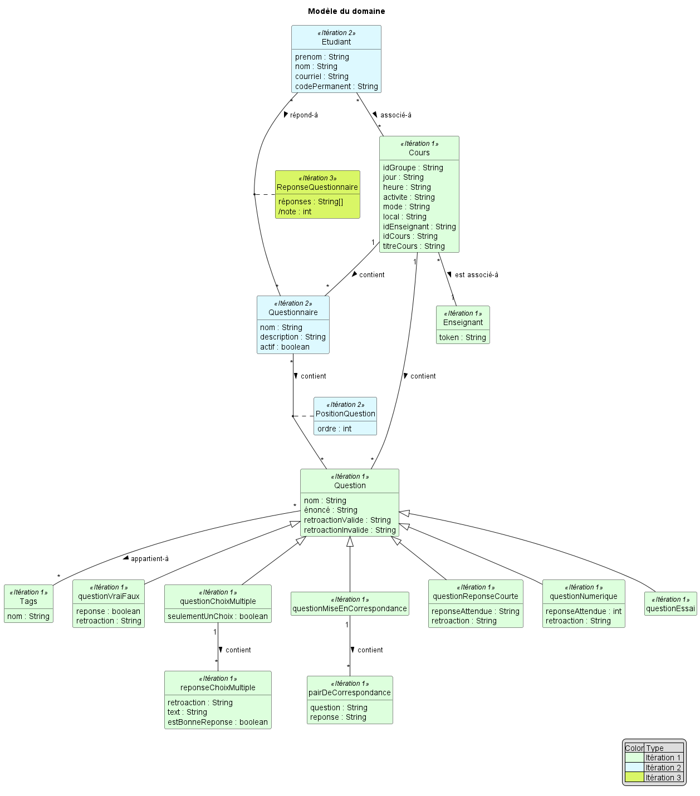
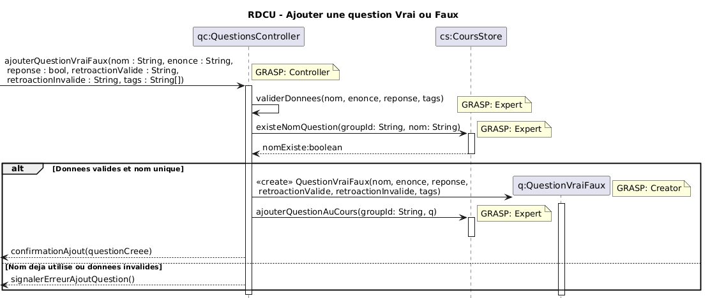
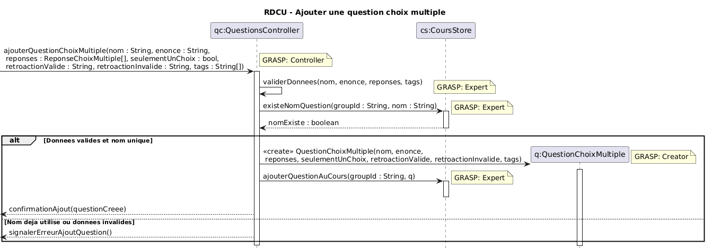
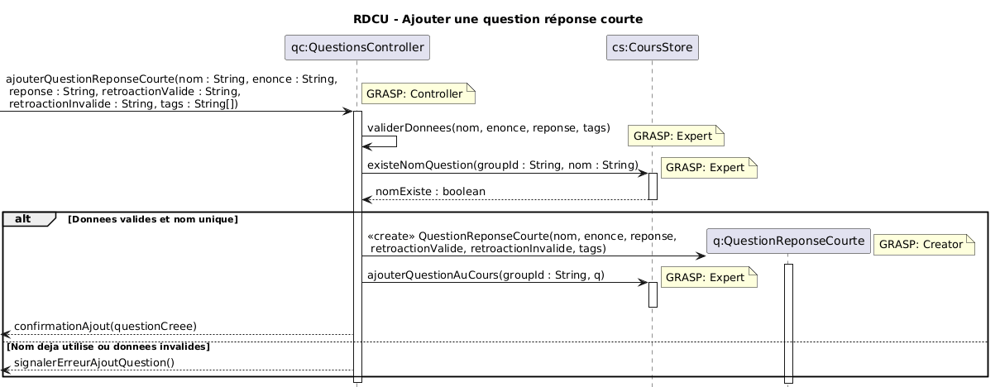
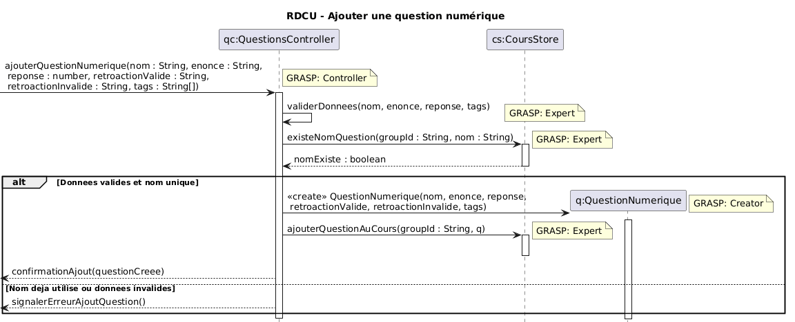
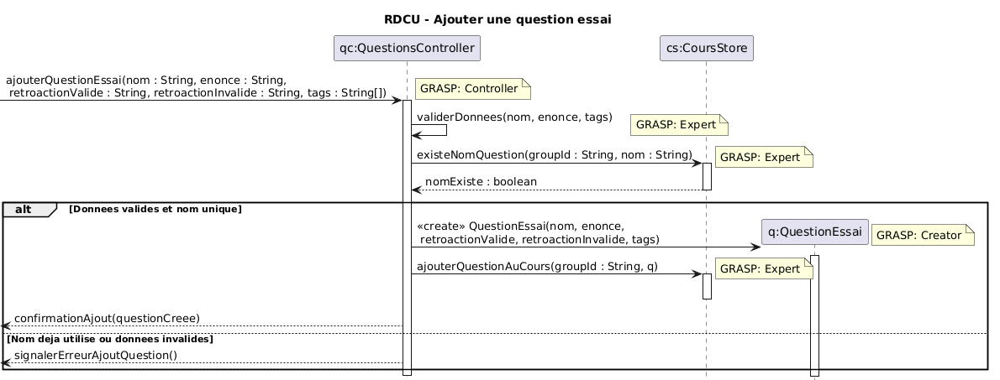
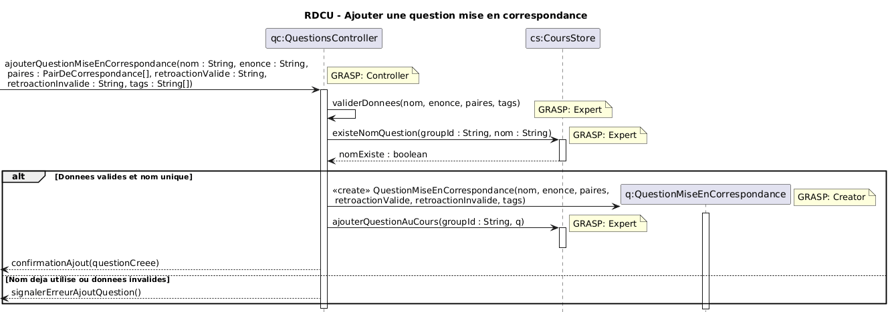

# Rapport Itération numéro 3

## Identification des membres de l'équipe

## Membre 1

- <nomComplet1>Ardy, Yahya</nomComplet1>
- <courriel1>yahya.ardy.1@ens.etsmtl.ca</courriel1>
- <codeMoodle1>AT73950</codeMoodle1>
- <githubAccount1>xMrYahya</githubAccount1>

## Membre 2

- <nomComplet2>Boulianne, Alex</nomComplet2>
- <courriel2>alex.boulianne.1@ens.etsmtl.ca</courriel2>
- <codeMoodle2>AT72810</codeMoodle2>
- <githubAccount2>c4tiki</githubAccount2>

## Membre 3

- <nomComplet3>Gamache, Alexandre</nomComplet3>
- <courriel3>alexandre.gamache.1@ens.etsmtl.ca</courriel3>
- <codeMoodle3>AU74150</codeMoodle3>
- <githubAccount3>AlexandreG17</githubAccount3>

## Membre 4

- <nomComplet4>Hoffmann, Raphaël</nomComplet4>
- <courriel4>raphael.hoffmann.1@ens.etsmtl.ca</courriel4>
- <codeMoodle4>AU65470</codeMoodle4>
- <githubAccount4>WishPib</githubAccount4>

## Membre 5

- <nomComplet5>Kandil, Kassem</nomComplet5>
- <courriel5>kassem.kandil.1@ens.etsmtl.ca</courriel5>
- <codeMoodle5>AU84220</codeMoodle5>
- <githubAccount5>kassem0303,kassem03-ets</githubAccount5>

## Exigences

| Nom / Description               | Assigné à (nom)     |
| --------------------------------| ------------------- |
| CU08a                            | (tous)              |
|   CU08a - conception             | Raphael + Alexandre |
|   CU08a - test et implémentation | Kassem + Yahya      |
|   CU08a - mise à jour des modèles| Alex                |

## Modèle du domaine (MDD)

## Diagramme de séquence système (DSS)

## Contrats
### Contrat CO29 - Consulter les questionnaires d'un cours
---
**Opération:selectionnerCours(idCours:String)**  
**Références croisées:**
- CU08 Passer questionnaire
- DSS Passer un questionnaire 
- MDD Questionnaire, Cours

**Préconditions:**
- L'étudiant est authentifié
- L'etudiant est inscrit au cours identifie par idCours

**PostConditions:**
- Aucune

### Contrat CO30 - Demarrer une tentative de questionnaire
---
**Opération:selectionnerQuestionnaire(nomQuestionnaire:String)**
**Références croisées:**
- CU08 Passer questionnaire
- DSS Passer un questionnaire 
- MDD Questionnaire, ReponseQuestionnaire

**Préconditions:**
- L'etudiant est authentifie
- L'étudiant a sélectionné un cours
- Le questionnaire identifie par nomQuestionnaire appartient au cours selectionne
- Le questionnaire identifie par nomQuestionnaire est actif
- Le questionnaire identifie par nomQuestionnaire fait partie des questionnaires a completer de l'etudiant

**PostConditions:**
- Une instance reponseQuestionnaire de ReponseQuestionnaire a ete creee
- reponseQuestionnaire a ete associee au questionnaire selectionne
- reponseQuestionnaire a ete associee a l'etudiant

### Contrat CO31 - Enregistrer la reponse de l'etudiant
---
**Opération:repondreQuestionChoixMultiple(reponse:String)**  
**Références croisées:**
- CU08 Passer questionnaire
- DSS Passer un questionnaire
- MDD ReponseQuestionnaire, Questionnaire, Question

**Préconditions:**
- L'etudiant est authentifie
- L'etudiant a une instance reponseQuestionnaire en cours
- La question courante du questionnaire en cours est une question de type choix multiple

**PostConditions:**
- La reponse reponseEtudiant a ete ajoutee a reponseQuestionnaire
- reponseQuestionnaire a ete mise a jour pour pointer la prochaine question, le cas echeant

## Réalisation de cas d'utilisation (RDCU)

### Diagramme de classe TPLANT
- Générer un diagramme de classe avec l'outil TPLANT et commenter celui-ci par rapport à votre MDD.
- https://www.npmjs.com/package/tplant
  
## Retour sur la correction du rapport précédent

### DSS Mis a jour
Ajouté le traitement pour chaque type de question dans le diagramme

### Contrats Mis a jour 

Contrats Ajouté et modifié pour le traitement de l'ajout de chaque tpe de question

### Contrat CO32 - Ajouter une question Vrai ou faux
---
**Opération:ajouterQuestionVraiFaux(nom : String, enonce : String, reponse : bool, retroactionValide : String, retroactionInvalide : String, tags : String[])**  
**Références croisées:**
- CU02a Ajouter une question
- DSS Ajouter une question
- MDD

**Préconditions:**
- Un cours est sélectionné
- nom n'est pas déja utilisé pour une question

**PostConditions:**
- une instance de q QuestionVraiFaux a été créé
- q.nom est devenu nom
- q.enonce est devenu enonce
- q.retroactionValide est devenu retroactionValide
- q.retroactionInvalide est devenu retroactionInvalide
- q.tags est devenu tags
- q.reponse est devenu reponse
- q a été associé au cours sélectionné

### Contrat CO33 - Ajouter une question Choix multiple
---
**Opération:ajouterQuestionChoixMultiple(nom : String, enonce : String, reponses : String[], retroactionValide : String, retroactionInvalide : String, tags : String[],seulementUnChoix : bool)**  
**Références croisées:**
- CU02a Ajouter une question
- DSS Ajouter une question
- MDD

**Préconditions:**
- Un cours est sélectionné
- nom n'est pas déja utilisé pour une question

**PostConditions:**
- une instance de q QuestionChoixMultiple a été créé
- q.nom est devenu nom
- q.enonce est devenu enonce
- q.retroactionValide est devenu retroactionValide
- q.retroactionInvalide est devenu retroactionInvalide
- q.tags est devenu tags
- q.reponseChoixMultiple est devenu reponses  

### RDCUs Mis a jour
Ajouté le RDCU pour le traitement des question VF

Ajouté le RDCU pour le traitement des questions Choix multiple

Ajouté le RDCU pour le traitement des questions Réponse courte

Ajouté le RDCU pour le traitement des questions numériques

Ajouté le RDCU pour le traitement des questions essai

Ajouté le RDCU pour les correpondances de questions

Ajouté la suppression du questionnaire dans le RDCU

## Vérification finale

- [ ] Vous avez un seul MDD
  - [ ] Vous avez mis un verbe à chaque association
  - [ ] Chaque association a une multiplicité
- [ ] Vous avez un DSS par cas d'utilisation
  - [ ] Chaque DSS a un titre
  - [ ] Chaque opération synchrone a un retour d'opération
  - [ ] L'utilisation d'une boucle (LOOP) est justifiée par les exigences
- [ ] Vous avez autant de contrats que d'opérations système (pour les cas d'utilisation nécessitant des contrats)
  - [ ] Les postconditions des contrats sont écrites au passé
- [ ] Vous avez autant de RDCU que d'opérations système
  - [ ] Chaque décision de conception (affectation de responsabilité) est identifiée et surtout **justifiée** (par un GRASP ou autre heuristique)
  - [ ] Votre code source (implémentation) est cohérent avec la RDCU (ce n'est pas juste un diagramme)
- [ ] Vous avez un seul diagramme de classes
- [ ] Vous avez remis la version PDF de ce document dans votre répertoire
- [X] [Vous avez regardé cette petite présentation pour l'architecture en couche et avez appliqué ces concepts](https://log210-cfuhrman.github.io/log210-valider-architecture-couches/#/) 
