# Rapport Itération numéro 3

## Identification des membres de l'équipe

## Membre 1

- <nomComplet1>Ardy, Yahya</nomComplet1>
- <courriel1>yahya.ardy.1@ens.etsmtl.ca</courriel1>
- <codeMoodle1>AT73950</codeMoodle1>
- <githubAccount1>xMrYahya</githubAccount1>

## Membre 2

- <nomComplet2>Boulianne, Alex</nomComplet2>
- <courriel2>alex.boulianne.1@ens.etsmtl.ca</courriel2>
- <codeMoodle2>AT72810</codeMoodle2>
- <githubAccount2>c4tiki</githubAccount2>

## Membre 3

- <nomComplet3>Gamache, Alexandre</nomComplet3>
- <courriel3>alexandre.gamache.1@ens.etsmtl.ca</courriel3>
- <codeMoodle3>AU74150</codeMoodle3>
- <githubAccount3>AlexandreG17</githubAccount3>

## Membre 4

- <nomComplet4>Hoffmann, Raphaël</nomComplet4>
- <courriel4>raphael.hoffmann.1@ens.etsmtl.ca</courriel4>
- <codeMoodle4>AU65470</codeMoodle4>
- <githubAccount4>WishPib</githubAccount4>

## Membre 5

- <nomComplet5>Kandil, Kassem</nomComplet5>
- <courriel5>kassem.kandil.1@ens.etsmtl.ca</courriel5>
- <codeMoodle5>AU84220</codeMoodle5>
- <githubAccount5>kassem0303,kassem03-ets</githubAccount5>

## Exigences

| Nom / Description               | Assigné à (nom)     |
| --------------------------------| ------------------- |
| CU08a                            | (tous)              |
|   CU08a - conception             | Raphael + Alexandre |
|   CU08a - test et implémentation | Kassem + Yahya      |
| Mise à jour des modèles          | Alex                |

## Modèle du domaine (MDD)

## Diagramme de séquence système (DSS)

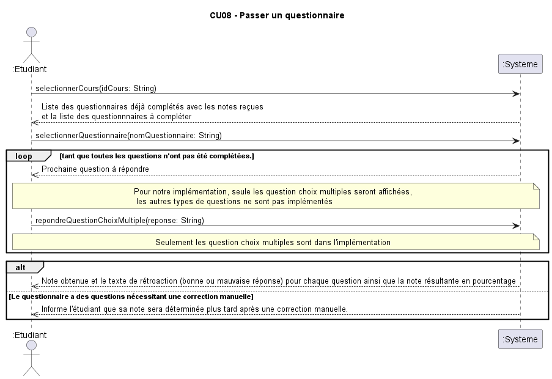

## Contrats
### Contrat CO29 - Consulter les questionnaires d'un cours
---
**Opération:selectionnerCours(idCours:String)**  
**Références croisées:**
- CU08 Passer questionnaire
- DSS Passer un questionnaire 
- MDD Questionnaire, Cours

**Préconditions:**
- L'étudiant est authentifié
- L'etudiant est inscrit au cours identifie par idCours

**PostConditions:**
- Aucune

### Contrat CO30 - Demarrer une tentative de questionnaire
---
**Opération:selectionnerQuestionnaire(nomQuestionnaire:String)**
**Références croisées:**
- CU08 Passer questionnaire
- DSS Passer un questionnaire 
- MDD Questionnaire, ReponseQuestionnaire

**Préconditions:**
- L'etudiant est authentifie
- L'étudiant a sélectionné un cours
- Le questionnaire identifie par nomQuestionnaire appartient au cours selectionne
- Le questionnaire identifie par nomQuestionnaire est actif
- Le questionnaire identifie par nomQuestionnaire fait partie des questionnaires a completer de l'etudiant

**PostConditions:**
- Une instance reponseQuestionnaire de ReponseQuestionnaire a ete creee
- reponseQuestionnaire a ete associee au questionnaire selectionne
- reponseQuestionnaire a ete associee a l'etudiant

### Contrat CO31 - Enregistrer la reponse de l'etudiant
---
**Opération:repondreQuestionChoixMultiple(reponse:String)**  
**Références croisées:**
- CU08 Passer questionnaire
- DSS Passer un questionnaire
- MDD ReponseQuestionnaire, Questionnaire, Question

**Préconditions:**
- L'etudiant est authentifie
- L'etudiant a une instance reponseQuestionnaire en cours
- La question courante du questionnaire en cours est une question de type choix multiple

**PostConditions:**
- La reponse reponseEtudiant a ete ajoutee a reponseQuestionnaire
- reponseQuestionnaire a ete mise a jour pour pointer la prochaine question, le cas echeant

## Réalisation de cas d'utilisation (RDCU)

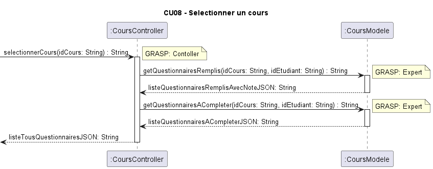

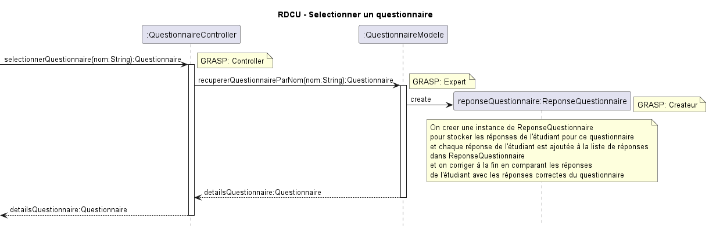

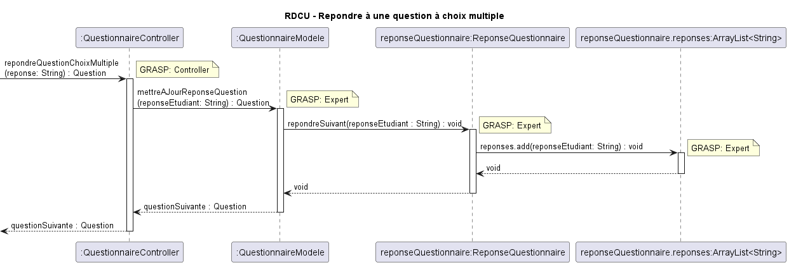

### Diagramme de classe TPLANT

C'est possible de constater, en obbservant le diagramme de classe généré par TPLANT, que les fonctions de nos rdcus sont présent dans nos controlleurs. Il est possible de constater que les différences majeurs avec le MDD sont les Modèles qui nous permettent de récuperer facilement les cours qu'on peut stocker dans un fichier json. Ils sont donc des représentations des classes et nous permettent de suivre l'architecture MVC. De plus, l'étudiant, comme l'enseignant n'ont pas de classes propre a eux dans le code puisque seul le courriel est utilisé afin de récuperer les Questions,Cours, Questionnaires et notes. Cela nous permet de simplifier la structure de notre code en utilisant le courriel pour les correspondances.

  
## Retour sur la correction du rapport précédent

### DSS Mis a jour
Ajouté le traitement pour chaque type de question dans le diagramme

Ajouté le traitement pour chaque type de question modifié

Mise à jour des artefacts du CU01 pour réaligner les diagrammes avec le code:

Modification du DSS d'ajout de cours pour retirer la boucle "tant qu'un cours existe déjà" et la remplacer par une liste filtrée des cours non ajoutés, puis une confirmation d'ajout.
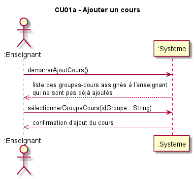

Modification du DSS de récupération de cours pour inclure la liste des questions avec les informations du cours et les étudiants inscrits.
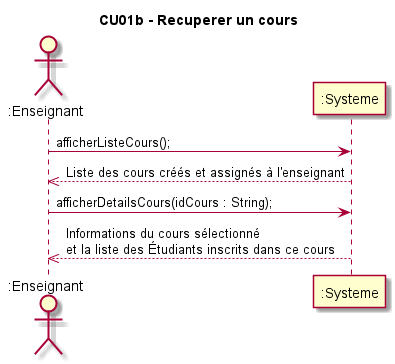

Modification du DSS de retrait de cours pour représenter les étapes réelles du code: demande de confirmation, affichage de la confirmation, puis suppression du cours.
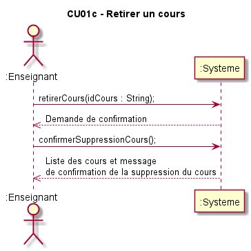

### Contrats Mis a jour 

Le contrat CO21 à été supprimé et le Code de gererQuestionnaire correspond maintenant au CO15 (il affiche seulement les questionnaires et ne modifie pas l'information)

Contrats 32 à 37 Ajouté ou modifiés pour le traitement de l'ajout de chaque type de question

### Contrat CO32 - Ajouter une question Vrai ou faux
---
**Opération:ajouterQuestionVraiFaux(nom : String, enonce : String, reponse : bool, retroactionValide : String, retroactionInvalide : String, tags : String[])**  
**Références croisées:**
- CU02a Ajouter une question
- DSS Ajouter une question
- MDD

**Préconditions:**
- Un cours est sélectionné
- nom n'est pas déja utilisé pour une question

**PostConditions:**
- une instance de q QuestionVraiFaux a été créé
- q.nom est devenu nom
- q.enonce est devenu enonce
- q.retroactionValide est devenu retroactionValide
- q.retroactionInvalide est devenu retroactionInvalide
- q.tags est devenu tags
- q.reponse est devenu reponse
- q a été associé au cours sélectionné

### Contrat CO33 - Ajouter une question Choix multiple
---
**Opération:ajouterQuestionChoixMultiple(nom : String, enonce : String, reponses : String[], retroactionValide : String, retroactionInvalide : String, tags : String[],seulementUnChoix : bool)**  
**Références croisées:**
- CU02a Ajouter une question
- DSS Ajouter une question
- MDD

**Préconditions:**
- Un cours est sélectionné
- nom n'est pas déja utilisé pour une question

**PostConditions:**
- une instance q de QuestionChoixMultiple a été créé
- q.nom est devenu nom
- q.enonce est devenu enonce
- q.retroactionValide est devenu retroactionValide
- q.retroactionInvalide est devenu retroactionInvalide
- q.tags est devenu tags
- q.reponseChoixMultiple est devenu reponses  

### Contrat CO34 - Ajouter une question Réponse Courte
---
**Opération: ajouterQuestionReponseCourte(nom : String, enonce : String, reponse : String, retroactionValide : String, retroactionInvalide : String, tags : String[])**
**Références Croisées:**
- CU02a Ajouter une question
- DSS Ajouter une question
- MDD

**Préconditions:**
- Un cours est sélectionné
- nom n'est pas déja utilisé pour une question

**PostConditions:**
- une instance q de QuestionReponseCourte a été créé
- q.nom est devenu nom
- q.enonce est devenu enonce
- q.retroactionValide est devenu retroactionValide
- q.retroactionInvalide est devenu retroactionInvalide
- q.tags est devenu tags
- q.reponse est devenu reponse

### Contrat CO35 - Ajouter une question Réponse Numérique
---
**Opération:  ajouterQuestionReponseNumerique(nom : String, enonce : String, reponse : number, retroactionValide : String, retroactionInvalide : String, tags : String[])**
**Références Croisées:**
- CU02a Ajouter une question
- DSS Ajouter une question
- MDD

**Préconditions:**
- Un cours est sélectionné
- nom n'est pas déja utilisé pour une question

**PostConditions:**
- une instance q de QuestionReponseNumerique a été créé
- q.nom est devenu nom
- q.enonce est devenu enonce
- q.reponse est devenu reponse
- q.retroactionValide est devenu retroactionValide
- q.retroactionInvalide est devenu retroactionInvalide
- q.tags est devenu tags

### Contrat CO36 - Ajouter une question Essai
---
**Opération: ajouterQuestionEssai(nom : String, enonce : String, retroactionValide : String, retroactionInvalide : String, tags : String[])**
**Références Croisées:**
- CU02a Ajouter une question
- DSS Ajouter une question
- MDD 

**Préconditions:**
- Un cours est sélectionné
- nom n'est pas déja utilisé pour une question

**PostConditions:**
- une instance q de QuestionEssai a été créé
- q.nom est devenu nom
- q.enonce est devenu enonce
- q.retroactionValide est devenu retroactionValide
- q.retroactionInvalide est devenu retroactionInvalide
- q.tags est devenu tags

### Contrat CO37 - Ajouter une question Mise en Correspondance
---
**Opération: ajouterQuestionMiseCorrespondance(nom : String, enonce : String, pairesQuestion : String[], pairesReponse : String[], retroactionValide : String, retroactionInvalide : String, tags : String[])**
**Références Croisées:**
- CU02a Ajouter une question
- DSS Ajouter une question
- MDD

**Préconditions:**
- Un cours est sélectionné
- nom n'est pas déja utilisé pour une question

**PostConditions:**

- une instance q de QuesionMiseCorrespondance a été créé
- q.nom est devenu nom
- q.enonce est devenu énoncé
- q.pairesQuestion est devenu pairesQuestion
- q.pairesReponse est devenu pairesReponse
- q.retroactionValide est devenu retroactionValide
- q.retroactionInvalide est devenu retroactionInvalide
- q.tags est devenu tags

Les contrats 38 à 43  on été ajouté ou modifié pour représenter la modification de chaque type de question.

### Contrat CO38 - Modifier une question Vrai ou faux
---
**Opération:modifierQuestionVraiFaux(nouveauNom : String, enonce : String, reponse : bool, retroactionValide : String, retroactionInvalide : String, tags : String[])**  
**Références croisées:**
- CU02c modifier une question
- DSS Modifier une question
- MDD

**Préconditions:**
- Un cours est sélectionné
- nouveauNom n'est pas déja utilisé pour une question

**PostConditions:**
- une instance de q QuestionVraiFaux a été créé
- q.nom est devenu nouveauNom
- q.enonce est devenu enonce
- q.retroactionValide est devenu retroactionValide
- q.retroactionInvalide est devenu retroactionInvalide
- q.tags est devenu tags
- q.reponse est devenu reponse
- q a été associé au cours sélectionné

### Contrat CO39 - Modifier une question Choix multiple
---
**Opération:modifierQuestionChoixMultiple(nouveauNom : String, enonce : String, reponses : String[], retroactionValide : String, retroactionInvalide : String, tags : String[],seulementUnChoix : bool)**  
**Références croisées:**
- CU02c Modifier une question
- DSS Modifier une question
- MDD

**Préconditions:**
- Un cours est sélectionné
- nouveauNom n'est pas déja utilisé pour une question

**PostConditions:**
- une instance q de QuestionChoixMultiple a été créé
- q.nom est devenu nouveauNom
- q.enonce est devenu enonce
- q.retroactionValide est devenu retroactionValide
- q.retroactionInvalide est devenu retroactionInvalide
- q.tags est devenu tags
- q.reponseChoixMultiple est devenu reponses  

### Contrat CO40 - Modifier une question Réponse Courte
---
**Opération: modifierQuestionReponseCourte(nouveauNom : String, enonce : String, reponse : String, retroactionValide : String, retroactionInvalide : String, tags : String[])**
**Références Croisées:**
- CU02c Modifier une question
- DSS Modifier une question
- MDD

**Préconditions:**
- Un cours est sélectionné
- nouveauNom n'est pas déja utilisé pour une question

**PostConditions:**
- une instance q de QuestionReponseCourte a été créé
- q.nom est devenu nouveauNom
- q.enonce est devenu enonce
- q.retroactionValide est devenu retroactionValide
- q.retroactionInvalide est devenu retroactionInvalide
- q.tags est devenu tags
- q.reponse est devenu reponse

### Contrat CO41 - Modifier une question Réponse Numérique
---
**Opération:  modifierQuestionReponseNumerique(nouveauNom : String, enonce : String, reponse : number, retroactionValide : String, retroactionInvalide : String, tags : String[])**
**Références Croisées:**
- CU02c Modifier une question
- DSS Modifier une question
- MDD

**Préconditions:**
- Un cours est sélectionné
- nouveauNom n'est pas déja utilisé pour une question

**PostConditions:**
- une instance q de QuestionReponseNumerique a été créé
- q.nom est devenu nouveauNom
- q.enonce est devenu enonce
- q.reponse est devenu reponse
- q.retroactionValide est devenu retroactionValide
- q.retroactionInvalide est devenu retroactionInvalide
- q.tags est devenu tags

### Contrat CO42 - Modifier une question Essai
---
**Opération: modifierQuestionEssai(nouveauNom : String, enonce : String, retroactionValide : String, retroactionInvalide : String, tags : String[])**
**Références Croisées:**
- CU02c Modifier une question
- DSS Modifier une question
- MDD 

**Préconditions:**
- Un cours est sélectionné
- nouveauNom n'est pas déja utilisé pour une question

**PostConditions:**
- une instance q de QuestionEssai a été créé
- q.nom est devenu nouveauNom
- q.enonce est devenu enonce
- q.retroactionValide est devenu retroactionValide
- q.retroactionInvalide est devenu retroactionInvalide
- q.tags est devenu tags

### Contrat CO43 - Modifier une question Mise en Correspondance
---
**Opération: modifierQuestionMiseCorrespondance(nouveauNom : String, enonce : String, pairesQuestion : String[], pairesReponse : String[], retroactionValide : String, retroactionInvalide : String, tags : String[])**
**Références Croisées:**
- CU02c Modifier une question
- DSS Modifier une question
- MDD

**Préconditions:**
- Un cours est sélectionné
- nouveauNom n'est pas déja utilisé pour une question

**PostConditions:**

- une instance q de QuesionMiseCorrespondance a été créé
- q.nom est devenu nouveauNom
- q.enonce est devenu énoncé
- q.pairesQuestion est devenu pairesQuestion
- q.pairesReponse est devenu pairesReponse
- q.retroactionValide est devenu retroactionValide
- q.retroactionInvalide est devenu retroactionInvalide
- q.tags est devenu tags

### RDCUs Mis a jour

Modification du RDCU de démarrage d'ajout de cours pour ajouter les paramètres `teacherId` / `token` et l'appel à `SgbClient.getCours`.
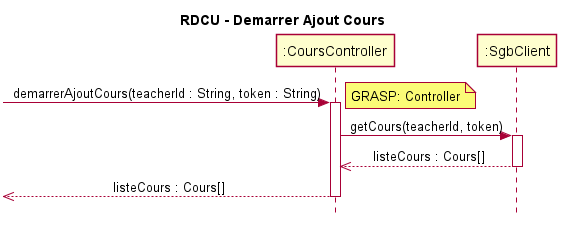

Modification du RDCU de sélection d'un groupe-cours pour ajouter le flux réel `getCoursParGroupe`, `getEtudiantsParGroupe`, construction du `Cours`, puis `ajouterCoursStocke`.
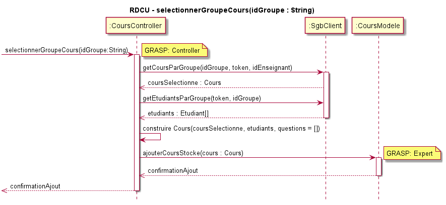

Modification du RDCU d'affichage de la liste des cours pour correspondre au chargement des cours stockés et au rendu de la page d'accueil.
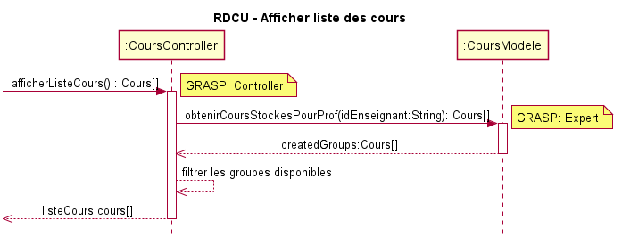

Modification du RDCU d'affichage des détails d'un cours pour inclure les questions et le rendu de la page des questions.
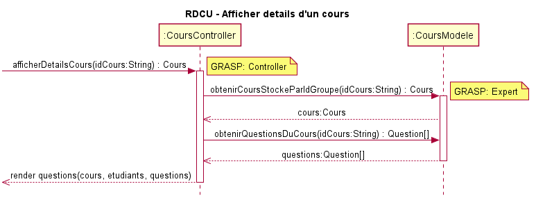

Modification du RDCU de retrait de cours pour représenter la redirection vers l'étape de confirmation.
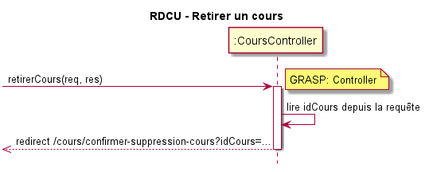

Modification du RDCU de confirmation de retrait pour représenter la suppression réelle du cours et la redirection avec message de succès.
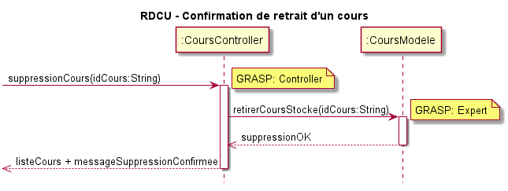

Ajouté le RDCU pour le traitement unique au questions VF

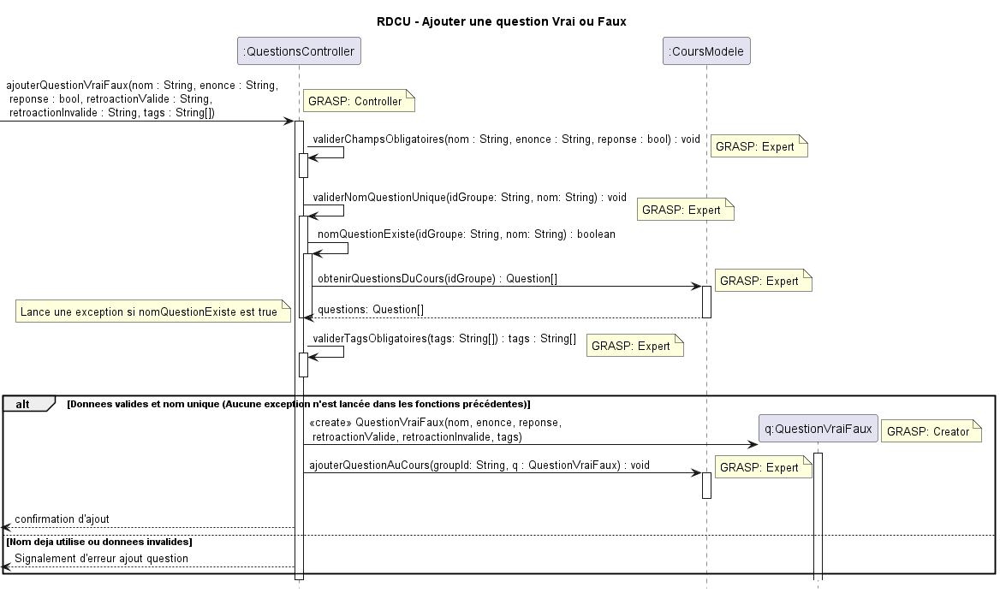

Ajouté le RDCU pour le traitement des questions Choix multiple

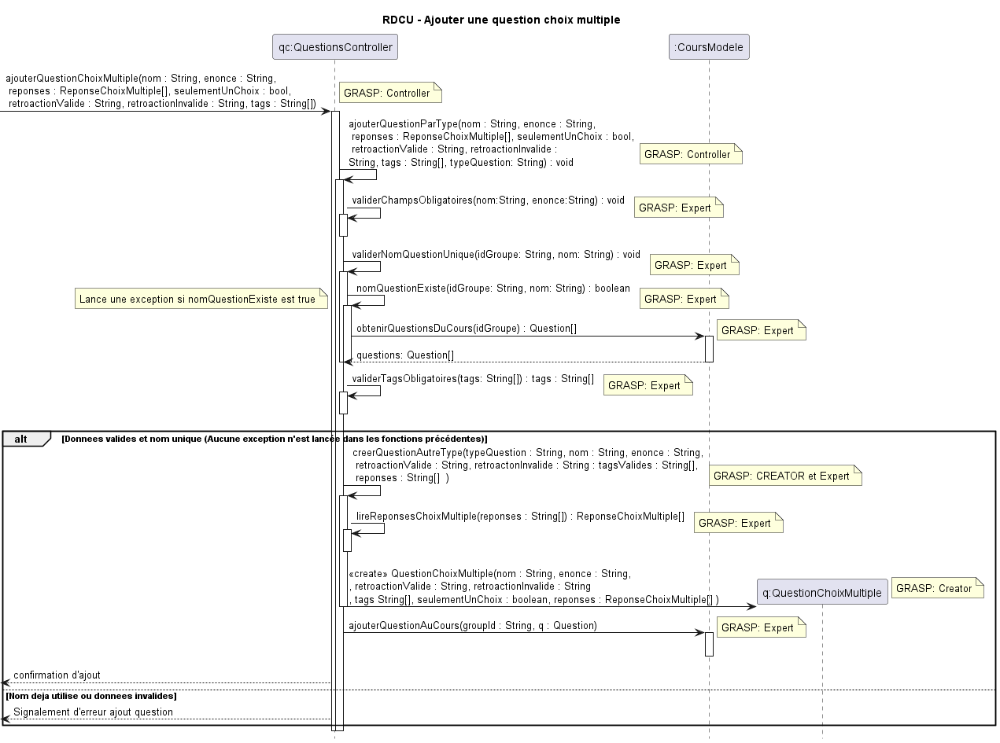

Ajouté le RDCU pour le traitement des questions Réponse courte

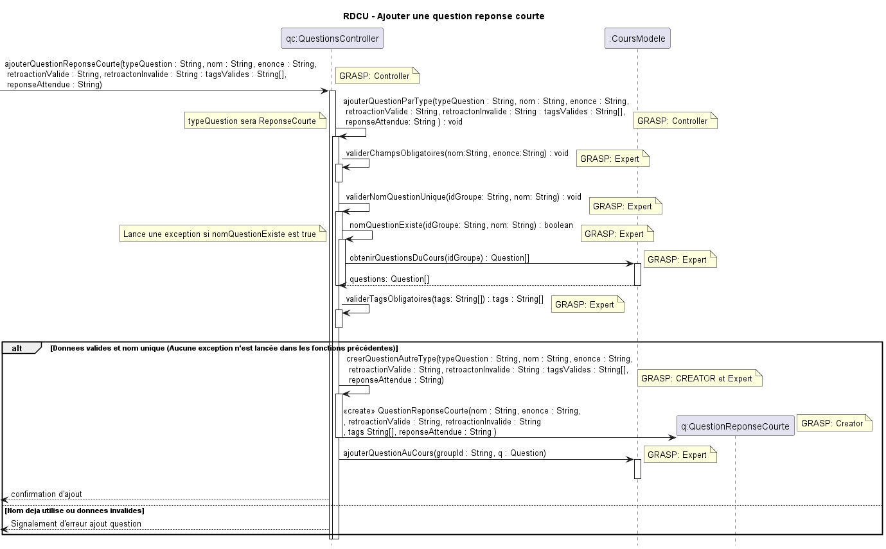

Ajouté le RDCU pour le traitement des questions numériques

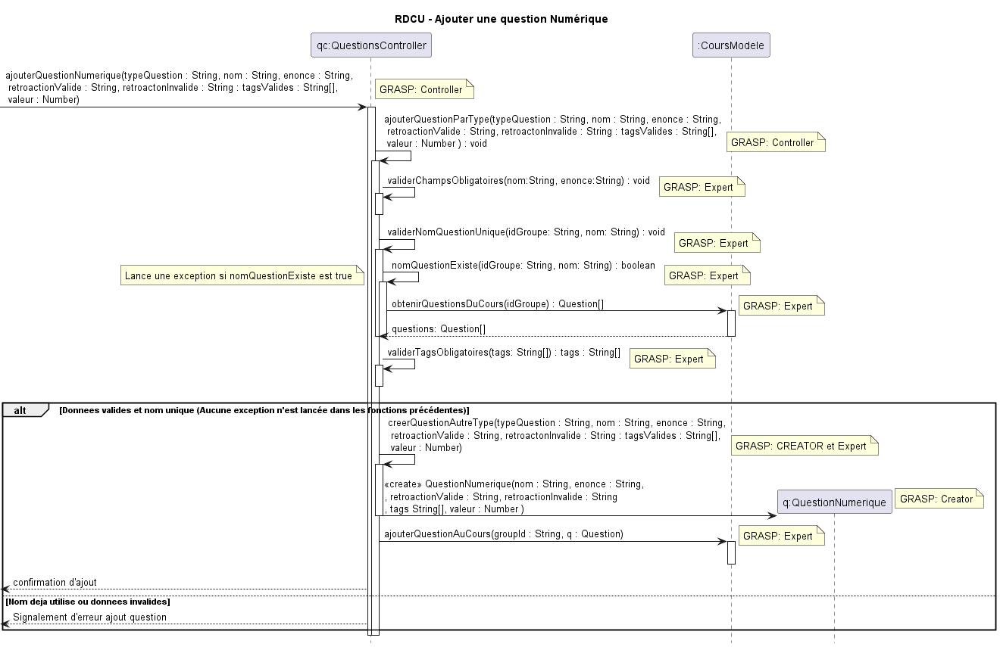

Ajouté le RDCU pour le traitement des questions essai

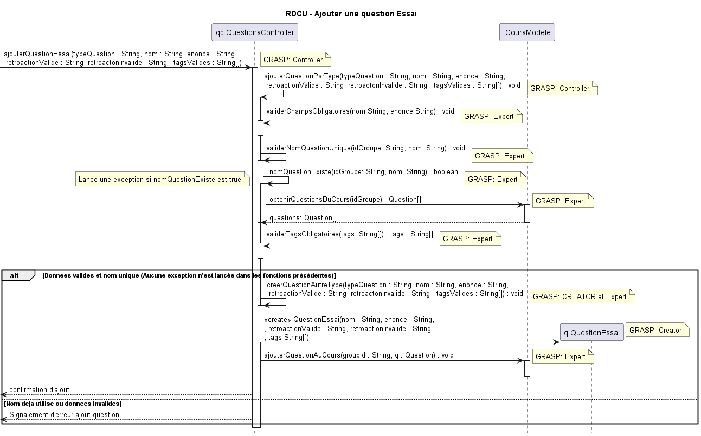

Ajouté le RDCU pour les correpondances de questions

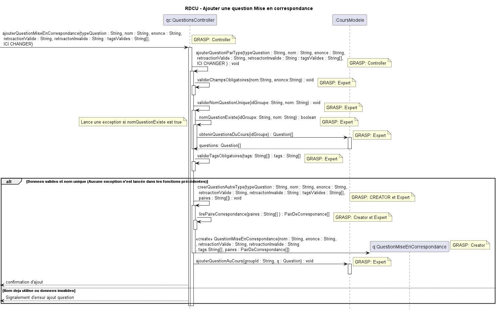

Ajouté la suppression d'une question dans le RDCU 

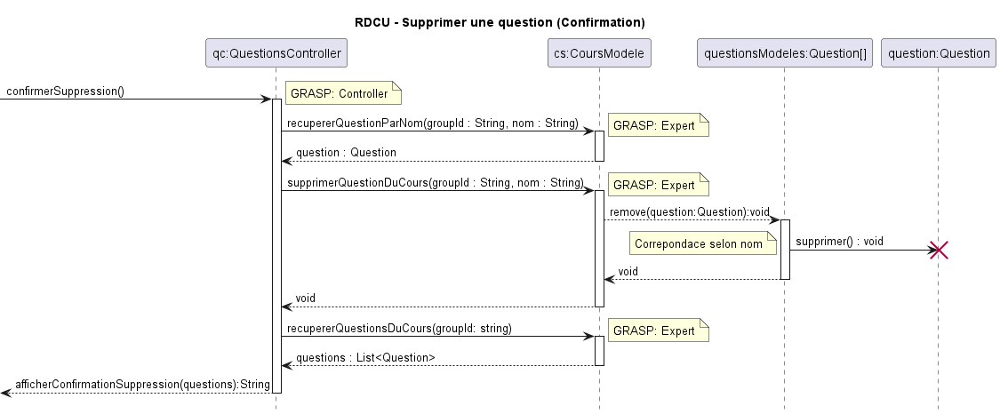

Ajouté la suppression du questionnaire dans le RDCU

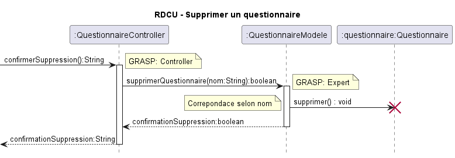

Ajouté un RDCU pour la modification des questions, le CO a été fragmenté pour chaque type de question puisqu'il utilise les rdcu d'ajout de question. Ce RDCU englobe donc les CO 28 à
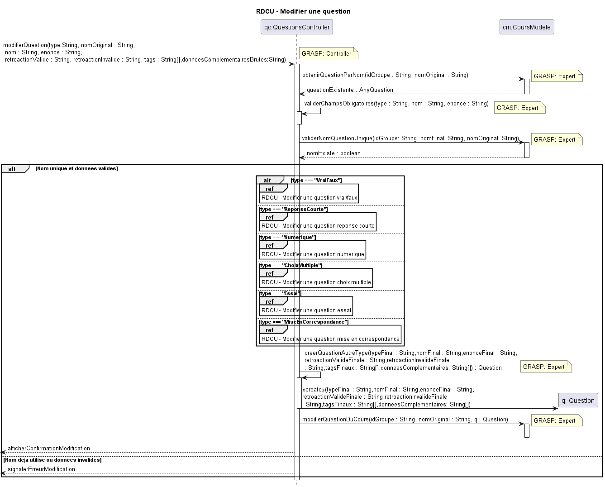

Modification du retour pour qu'il ne soit pas un appel de méthode
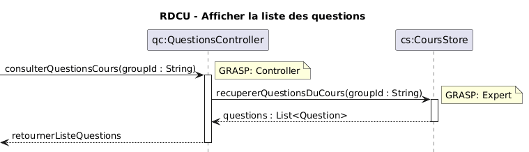

Modification pour suivre le nom des classes et fonction dans le code
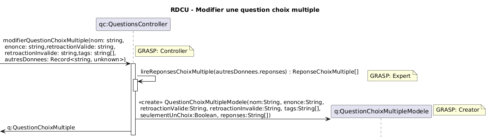

Modification pour suivre le nom des classes et fonction dans le code
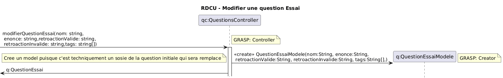

Modification pour suivre le nom des classes et fonction dans le code
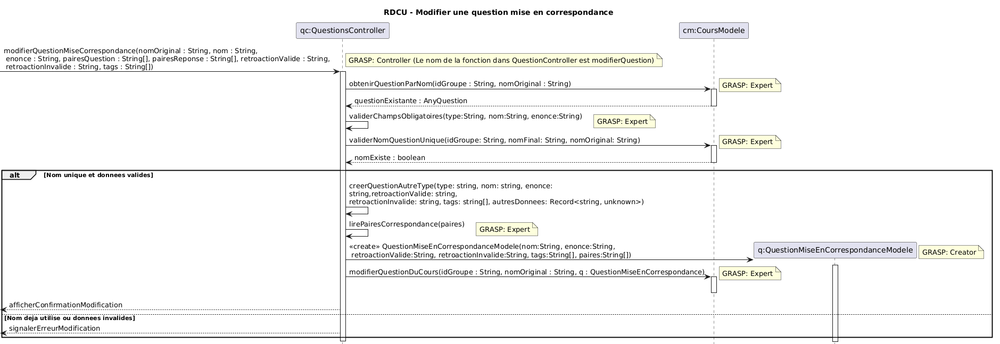

Modification pour suivre le nom des classes et fonction dans le code
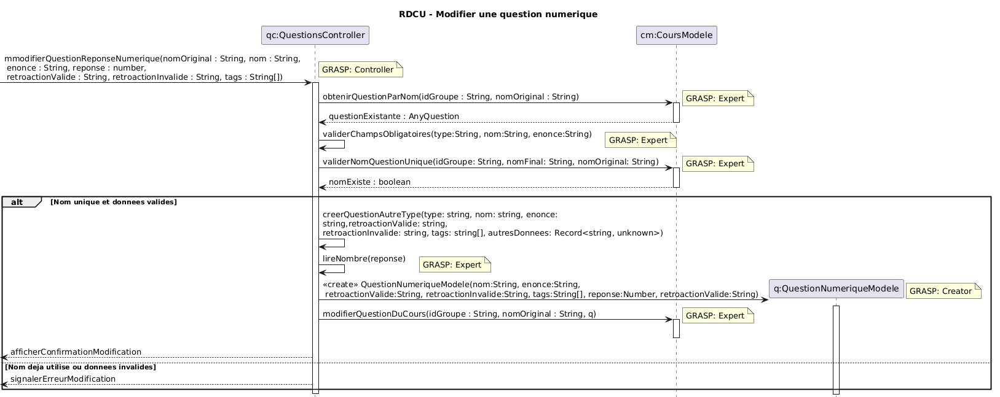

Modification pour suivre le nom des classes et fonction dans le code
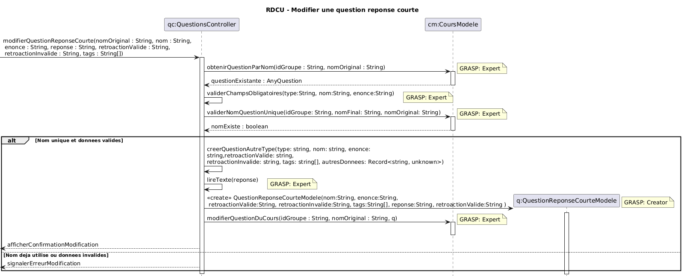

Modification pour suivre le nom des classes et fonction dans le code
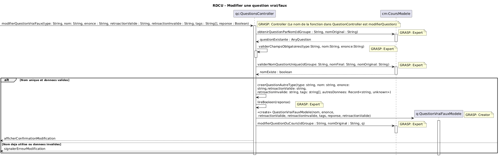

Modification du retour pour qu'il ne soit pas un appel de méthode
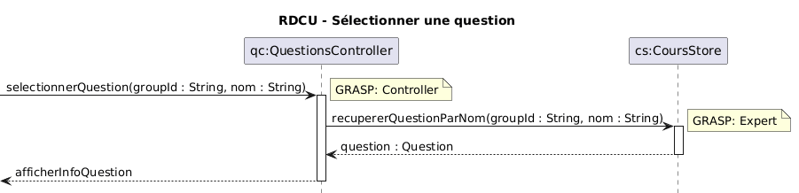

Modification du retour pour qu'il ne soit pas un appel de méthode
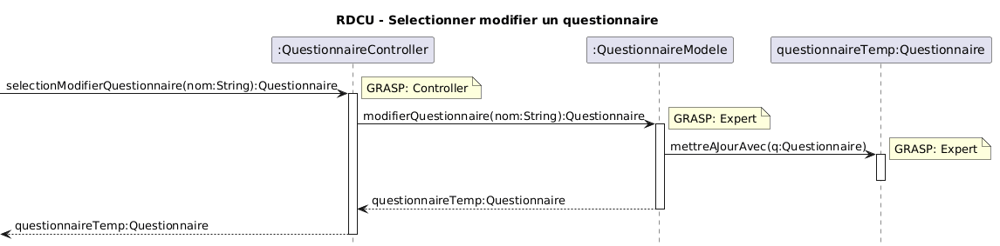

Ajout des flèches de retour
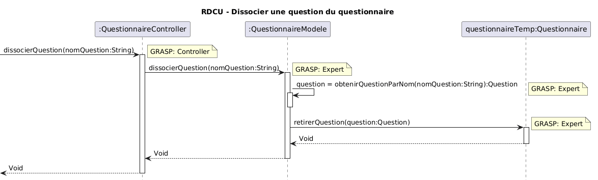

Ajout des flèches de retour
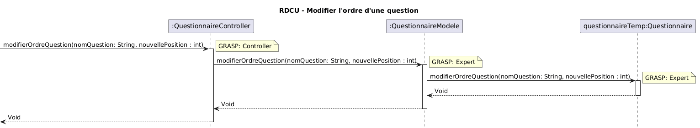

Retirer un participant inutile
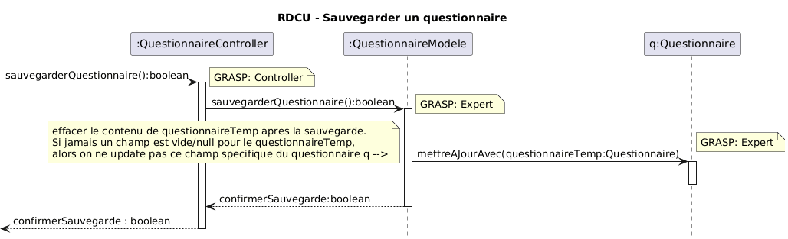

## Vérification finale

- [X] Vous avez un seul MDD
  - [X] Vous avez mis un verbe à chaque association
  - [X] Chaque association a une multiplicité
- [X] Vous avez un DSS par cas d'utilisation
  - [X] Chaque DSS a un titre
  - [X] Chaque opération synchrone a un retour d'opération
  - [X] L'utilisation d'une boucle (LOOP) est justifiée par les exigences
- [ ] Vous avez autant de contrats que d'opérations système (pour les cas d'utilisation nécessitant des contrats)
  - [ ] Les postconditions des contrats sont écrites au passé
- [ ] Vous avez autant de RDCU que d'opérations système
  - [ ] Chaque décision de conception (affectation de responsabilité) est identifiée et surtout **justifiée** (par un GRASP ou autre heuristique)
  - [ ] Votre code source (implémentation) est cohérent avec la RDCU (ce n'est pas juste un diagramme)
- [ ] Vous avez un seul diagramme de classes
- [ ] Vous avez remis la version PDF de ce document dans votre répertoire
- [X] [Vous avez regardé cette petite présentation pour l'architecture en couche et avez appliqué ces concepts](https://log210-cfuhrman.github.io/log210-valider-architecture-couches/#/) 
